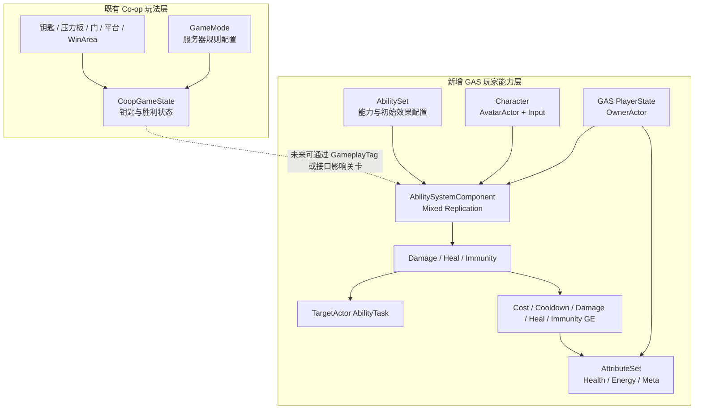
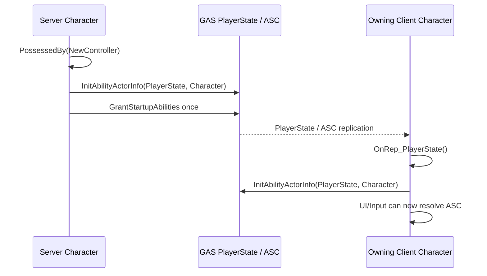
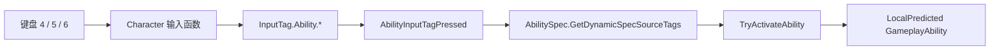

# Co-op GAS 架构与面试讲解手册

> 适用分支：`coop-GAS`
>
> 引擎版本：Unreal Engine 5.5
> 文档目标：准确讲清已经实现的内容、尚未验证的内容，以及面对条件变化时如何演进架构。

## 0. 一分钟项目说明

这是一个从双人合作机关 Demo 演进出的 GAS 网络实验项目，而不是 Aura 的换皮版本。

原项目已经具备服务器权威的钥匙、压力板、移动平台、门、胜利区和双人联机。本分支没有用 GAS 重写这些成熟机关，而是在同一套网络环境中增加独立的玩家能力层：

- 伤害能力；
- 自我治疗能力；
- 状态免疫能力；
- 客户端预测激活、Cost 和 Cooldown；
- TargetData 与 PredictionKey；
- 服务器目标验证和最终数值结算；
- 属性和状态向两名玩家同步。

核心设计原则是：

> 客户端可以预测操作体验，但不能决定其他玩家的最终状态。

当前项目的优势是闭环小、网络边界明确、代码可以完整解释。当前不足是视觉表现、双客户端人工验收、预测拒绝实验和 Network Insights 性能报告尚未完成。

---

## 1. 项目边界和模块划分

### 1.1 总体架构



### 1.2 为什么不把机关全部改成 GAS

压力板、门、钥匙和胜利判定属于世界规则：

- 它们没有技能的 Cost、Cooldown、预测激活需求；
- 服务器权威 Actor + RepNotify 已经能准确表达状态；
- 强行改成 GameplayAbility 或 GameplayEffect 会增加 ASC 依赖和调试复杂度；
- GAS 最适合表达玩家拥有的能力、属性和临时状态，而不是替代所有 Gameplay 代码。

因此当前边界是：世界机关继续使用普通网络 Actor，玩家战斗状态使用 GAS。后续如果免疫状态需要影响机关，只通过 GameplayTag 查询或接口连接两层，不重写机关。

### 1.3 主要源码职责

| 文件/目录 | 职责 |
|---|---|
| `AbilitySystem/multiplayerGameplayTags.*` | 原生 Input、Ability、State、Effect、Data、Cooldown 标签 |
| `AbilitySystem/multiplayerAbilitySystemComponent.*` | 根据 InputTag 查找 AbilitySpec，转发按下/释放和 GAS 通用复制事件 |
| `AbilitySystem/multiplayerAttributeSet.*` | 属性复制、Clamp、伤害与治疗 Meta Attribute 结算 |
| `AbilitySystem/multiplayerAbilitySet.*` | 批量授予 Ability、应用初始 Effect、保存撤销句柄 |
| `AbilitySystem/Abilities/multiplayerGameplayAbility.*` | 三个能力的激活、Commit 和服务器效果应用 |
| `AbilitySystem/AbilityTasks/multiplayerAbilityTask_TargetActor.*` | 本地选取目标，并在预测窗口内向服务器上传 TargetData |
| `AbilitySystem/multiplayerGameplayEffects.*` | 伤害、治疗、免疫、Cost、Cooldown 的 C++ 默认 GE |
| `Player/multiplayerGASPlayerState.*` | ASC/AttributeSet 所有权、属性委托、默认能力授予 |
| `multiplayerCharacter.*` | Avatar 初始化和临时 `4/5/6` 输入入口 |
| `Tests/multiplayerGASAutomationTests.cpp` | 标签、预测策略、GE 配置和免疫组件的启动级验证 |

---

## 2. ASC 所有权与初始化

### 2.1 OwnerActor 和 AvatarActor

当前调用：

```cpp
AbilitySystemComponent->InitAbilityActorInfo(PlayerState, Character);
```

- `PlayerState` 是 OwnerActor：表示跨 Pawn 生命周期保存的玩家能力状态。
- `Character` 是 AvatarActor：表示技能当前实际操纵的身体、位置、动画和碰撞。
- Actor 的网络 Owner 是另一层概念，它决定客户端能否向服务器发送所属 Actor 的 RPC。GAS 的 OwnerActor/AvatarActor 描述的是能力上下文，不能与网络 Ownership 混为一谈。

### 2.2 为什么 ASC 放在 PlayerState

采用 PlayerState 的原因：

- 玩家死亡、重生或换 Pawn 时可以保留技能、Cooldown 和长期状态；
- Character 只更新 Avatar，不需要重建整套 ASC；
- PlayerState 天然对应玩家身份，并复制给相关客户端。

没有采用 Character 持有 ASC 的原因：

- Character 销毁时 ASC 也会销毁；
- 重生需要重新授予技能、重新绑定 UI、处理旧 Effect；
- 对需要跨 Pawn 保存状态的玩家不合适。

如果项目永远没有重生、换 Pawn 或角色切换，Character ASC 会更简单；但这不是当前希望展示的工程方向。

### 2.3 为什么服务器和客户端都要初始化



- `PossessedBy` 只在服务器权威流程中可靠发生。
- 客户端等待 PlayerState 复制完成后，在 `OnRep_PlayerState` 初始化。
- 只在服务器初始化会导致客户端没有正确的 ActorInfo，LocalPredicted 技能不能正常工作。
- 只在客户端初始化则服务器没有权威能力上下文。
- 能力只由服务器授予一次；客户端不授予，换 Pawn 时也不能重复授予。

### 2.4 复制模式选择

玩家 ASC 当前使用 `Mixed`：

- 拥有者获得完整 Active GameplayEffect 信息；
- 其他模拟客户端只获得精简 Effect 信息，但仍能获得必要 Tag、Cue 和 Attribute 结果；
- 比 `Full` 更节省非拥有者带宽；
- 比 `Minimal` 更适合需要在拥有者 UI 显示 Cost、Cooldown 和状态详情的玩家角色。

没有直接复制 Aura 的 `NetUpdateFrequency = 100`。当前 PlayerState 基线为 30Hz、最低 10Hz，因为 100Hz 是用带宽换延迟，不能在没有 Network Insights 数据时称为优化。

---

## 3. 输入和能力授予调用链

### 3.1 当前输入链



使用 GameplayTag 而不是 InputID/枚举的原因：

- 输入与具体 Ability 类解耦；
- 同一按键槽可以替换不同能力；
- AbilitySet 可以在授予时为 Spec 附加输入标签；
- 标签层级可以表达 `InputTag.Ability.*`；
- 更容易扩展重绑定、技能栏和调试工具。

当前 `4/5/6` 是无外部资产的验证入口，不是最终输入方案。正式版本应创建 InputAction、MappingContext 和 InputConfig DataAsset，仍然把结果转换为相同 InputTag。

### 3.2 AbilitySet 与默认能力

当前同时提供两条路径：

1. Character 配置了 AbilitySet：服务器按数据资产授予能力和初始 Effect。
2. 未配置 AbilitySet：PlayerState 授予三个内置 C++ Demo 能力。

保留 C++ fallback 是为了让分支在没有新增 `.uasset` 时也能编译和启动验证。正式内容应优先使用 AbilitySet，让角色配置数据化；fallback 最终可以只保留给自动化测试。

---

## 4. 伤害能力完整调用链

### 4.1 白板简图

面试时可以先画下面这一条：

```text
Client Input
-> ASC / AbilitySpec
-> LocalPredicted Activate
-> Predict Cost + Cooldown
-> AbilityTask selects Target
-> ScopedPredictionWindow
-> ServerSetReplicatedTargetData
-> Server validates Target
-> Server builds Damage Spec
-> SetByCaller(Data.Damage)
-> IncomingDamage Meta Attribute
-> PostGameplayEffectExecute
-> Health RepNotify
-> Client UI
```

### 4.2 时序图

```mermaid
sequenceDiagram
    participant C as Owning Client
    participant C_ASC as Client ASC
    participant S_ASC as Server ASC
    participant Target as Target ASC / AttributeSet
    participant Remote as Other Client

    C->>C_ASC: Press 4 / InputTag.Damage
    C_ASC->>C_ASC: LocalPredicted Activate
    C_ASC->>C_ASC: Predict Cost and Cooldown
    C_ASC->>C_ASC: Select nearest player target
    C_ASC->>S_ASC: TargetData + ActivationPredictionKey
    S_ASC->>S_ASC: Match SpecHandle and PredictionKey
    S_ASC->>S_ASC: Validate class, alive, range, line of sight
    alt Validation accepted
        S_ASC->>Target: Damage GE Spec + server DamageAmount
        Target->>Target: IncomingDamage -> Health
        Target-->>C: Replicate Health / state
        Target-->>Remote: Replicate Health / state
    else Validation rejected
        S_ASC-->>C_ASC: No authoritative damage; predicted state waits for GAS reconciliation
    end
```

### 4.3 信任边界

客户端当前只提交目标，不提交可信伤害值：

- `DamageAmount` 来自服务器上的 Ability CDO；
- 服务器确认目标确实是另一个 `AmultiplayerCharacter`；
- 服务器检查目标 ASC 和 Health；
- 服务器重新计算距离，并留 50 单位网络容差；
- 服务器执行 Visibility LineTrace；
- 验证通过后才创建 Damage GE Spec。

因此修改客户端内存中的伤害数值不能直接改变服务器最终结果。

当前服务器遇到非法目标时会取消服务器能力实例，并且不会 Commit 或应用伤害。客户端已经预测的 Cost/Cooldown 是否按预期消除，需要在双窗口拒绝实验中观察 PredictionKey 的 catch-up/reject 日志；目前只有架构和代码路径，不能把“非法目标回滚已通过运行验收”当成既有结论。

### 4.4 为什么使用 Meta Attribute

伤害写入 `IncomingDamage`，治疗写入 `IncomingHealing`，再在 `PostGameplayEffectExecute` 修改 Health。

优点：

- Health 修改入口集中；
- 便于加入护甲、免疫、受击、死亡、统计和来源信息；
- Meta Attribute 不需要作为长期状态复制；
- Damage GE 不必直接关心 Health Clamp。

当前不足是还没有 `ExecutionCalculation`。目前服务器直接使用固定伤害值；加入攻击力、护甲、暴击和抗性后，应由服务器 ExecCalc 输出 IncomingDamage。

---

## 5. 治疗和免疫调用链

### 5.1 治疗

当前治疗是 LocalPredicted 自我治疗：

```text
InputTag.Heal
-> CommitAbility
-> predict Energy Cost and Cooldown
-> server creates Heal GE with Data.Heal
-> IncomingHealing
-> clamp Health to MaxHealth
-> replicate Health
```

为什么第一版不是选择队友：重点先验证第二种 Meta Attribute 和正向 Effect 链路，不重复实现一套与伤害完全相同的 TargetData。后续改成队友治疗时可以复用 TargetActor Task，但服务器要增加队伍、距离、视线和存活验证。

### 5.2 状态免疫

```text
InputTag.Immunity
-> CommitAbility
-> duration GE for 5 seconds
-> grant State.Immune
-> ImmunityGameplayEffectComponent blocks Effect.Negative.*
-> effect expires and removes tag
```

没有只在 AttributeSet 中写 `if State.Immune then ignore damage`，因为那只能绕过当前伤害数值，不能统一阻止未来的控制、Debuff 和其他负面 GE。

当前仍在 AttributeSet 保留一次 `State.Immune` 检查作为防御性兜底，但正式规则的主要入口是 `UImmunityGameplayEffectComponent` 对负面 Effect Query 的阻止。

---

## 6. 技术选型与未采用方案

| 决策 | 当前选择 | 没有采用的方案 | 原因 |
|---|---|---|---|
| ASC 位置 | PlayerState | Character | 保留跨 Pawn 状态，支持重生/换 Pawn |
| 玩家 GE 复制 | Mixed | Full / Minimal | Owner 需要完整状态，其他客户端减少负担 |
| 激活策略 | LocalPredicted | ServerOnly | 改善输入响应，并能研究接受、拒绝与回滚 |
| 最终伤害 | Server Authority | 客户端直接 Apply | 防止客户端伪造目标和数值 |
| 输入标识 | GameplayTag | InputID / enum / 直接绑定类 | 解耦输入、技能类和技能栏配置 |
| 数值入口 | Meta Attribute | Damage GE 直接减 Health | 集中结算并为 ExecCalc、死亡、统计留扩展点 |
| 负面免疫 | Immunity GE Component + Tag | 每种伤害手写 bool 判断 | 可以统一扩展到控制和 Debuff |
| 技能配置 | AbilitySet + C++ fallback | 只在 Character 数组硬编码 | 正式内容数据化，同时保持零资产测试能力 |
| 机关架构 | 普通服务器权威 Actor | 全部 GAS 化 | 机关不需要 GAS 生命周期与预测能力 |
| 第一版表现 | 无外部素材 | 迁移 Aura Content | 避免许可证、二进制依赖和教程辨识度 |
| EffectContext | 使用引擎默认类型 | 立即自定义 NetSerialize | 当前没有必须携带的扩展字段，过早实现增加网络风险 |

---

## 7. 问题、难点与解决过程

本章只保留能够由用户复现记录、Git 历史、编译日志或当前源码证明的问题与设计难点。它不是“Bug 数量展示”，而是项目所有权证据。当前选择四个高价值案例：机关职责拆分、胜利事务设计、GAS 生命周期和自动化验证环境；其中胜利条件明确标为设计记录，不伪装成发生过的 Bug。

后续新增案例统一沿用这条主线：

```text
原始需求 -> 第一版方案 -> 现象/约束 -> 为什么难
-> 假设与工具 -> 根因或设计冲突 -> 候选方案比较
-> 最终修改 -> 边界保护 -> 分层验证 -> 遗留问题 -> 条件变化场景题
```

### COOP-001：门与压力板职责耦合，独立布置和委托关联失败（问题复盘）

#### 0. 原始需求与第一版方案

原始需求是：压力板能够独立下压，普通门可以引用一个或多个压力板，移动平台也可以复用压力板；机关必须由服务器判断，并在两名客户端保持一致。

第一版 `AmultiplayerCoopGate` 同时创建门网格、两块压力板网格、两个触发体，并在门类内部处理占用、压力板动画和门动画。这个版本能快速形成原型，但默认假设“每扇门固定拥有两块压力板”。对应历史提交为 `e41ae3f`。

#### 1. 现象

- 场景中放置门时，压力板与门作为同一个 Actor 的组件一起出现，不能像独立机关一样自由复用和关联。
- 用户实际观察到“压力板和门居然放在一起了”。
- 在蓝图中尝试绑定 `On Plate Active Changed` 时，`Target` 使用了 `self`，节点显示 `ERROR!`；当时 `self` 不是压力板实例。
- 正常预期是门只消费压力板状态，压力板自己处理碰撞、占用者和下压表现。
- 该问题同时影响关卡搭建、职责边界和多人权威逻辑的可维护性。

#### 2. 复现条件

1. 使用重构前提交 `e41ae3f` 的 `AmultiplayerCoopGate` 创建蓝图子类。
2. 查看 Components 树，会看到门和 Plate A/Plate B 都属于同一 Actor。
3. 尝试把其中一块板独立交给移动平台或另一扇门，无法直接引用一个独立 Actor。
4. 在门或平台蓝图的 BeginPlay 中添加 `Bind Event to On Plate Active Changed`，保持 `Target=self`。
5. 预期：绑定场景中的压力板并收到状态变化；实际：蓝图编译节点报错，因为委托所有者类型不匹配且 Event 引脚未完成正确接线。

#### 3. 为什么难

- 视觉上表现为“组件不能移动/门不响应”，容易先怀疑坐标、碰撞或 Timeline。
- 实际问题跨越了关卡组合方式、Actor 所有权、动态委托签名和服务器权威四层。
- C++ 类与蓝图都能发起绑定；如果两边同时成为规则来源，会出现重复绑定、错误 Target 或生命周期清理遗漏。
- 单机中直接调用门表现可能工作，但不能证明服务器维护的压力板状态和客户端复制正确。

#### 4. 初始假设

| 假设 | 为什么怀疑 | 如何验证 | 结果 |
|---|---|---|---|
| 组件 Transform 没有暴露，所以看起来无法拆开 | 用户同时遇到 Point/组件坐标轴问题 | 查看 Components 树和 C++ 构造函数 | 排除为主因；即使能移动相对坐标，压力板仍属于门 Actor |
| 碰撞设置阻止压力板或门移动 | 用户正在调整 Block/Overlap | 在不运行 PIE 时检查 Actor 组成和引用能力 | 排除为架构问题根因；碰撞会影响运行时触发，但不会把独立 Actor 合并成组件 |
| 蓝图委托节点本身失效 | 节点显示 `ERROR!` | 检查 `OnPlateActiveChanged` 声明、Target 类型和 Event 签名 | 排除；委托有效，错误来自 Target 不是压力板实例/事件未正确绑定 |
| 门同时拥有压力板状态和表现，职责耦合 | 第一版类包含两套 Plate Mesh/Trigger/Overlap 逻辑 | 对比 `e41ae3f` 与 `edfca0f`，检查当前源码 | 确认 |

#### 5. 使用的定位工具

- UE Components 树和 Details 面板：回答“压力板究竟是独立 Actor，还是门的子组件”。
- Blueprint 编译错误和节点类型提示：回答“委托属于哪个对象、`Target=self` 是否类型正确”。
- Git 历史对比 `e41ae3f -> edfca0f`：回答“问题是否真实发生，以及职责如何迁移”。
- 当前 C++ 源码检查：确认门在 `BindRequiredPlates` 中绑定压力板，在 `EndPlay` 中解绑，而不是依赖关卡蓝图维持规则。

#### 6. 根因

第一版以“快速做出一扇双压力板门”为边界，让 `AmultiplayerCoopGate` 同时成为门、压力板、触发器和占用状态的所有者。固定组件关系无法表达“一块压力板控制门或移动平台”的复用需求。

蓝图报错的具体根因则是委托所有权错误：`OnPlateActiveChanged` 属于 `AmultiplayerPressurePlate` 实例，而不是当前门/平台蓝图的 `self`。这不是委托系统失效。

#### 7. 候选方案与取舍

| 方案 | 能解决什么 | 新增成本 | 为什么采用/放弃 |
|---|---|---|---|
| 保留一体化 Gate，只暴露 Plate 相对位置 | 改动最小，适合固定双板门 | 固定数量、不能跨机关复用、门类继续承担碰撞状态 | 放弃；不满足已经明确的独立布置需求 |
| 全部由 Level Blueprint 手工绑定 | 可快速把任意对象接在一起 | 规则散落、Target 易接错、服务器和生命周期收口不清晰 | 不作为核心规则方案；只适合临时调试或表现 |
| 独立 PressurePlate Actor，门/平台持有引用并在 C++ 绑定 | 支持复用、明确所有权、便于服务器统一处理 | 需要数组引用、动态委托绑定/解绑和失效引用保护 | 采用；符合当前中小型关卡规模 |
| 引入通用 GameplayMessage/Event Bus | 进一步解耦发送者和接收者 | 调试链更长，当前机关数量不需要全局消息系统 | 暂不采用；规模扩大后再评估 |

#### 8. 最终解决方案

修改前：

```text
Gate Actor
-> 创建 Door Mesh
-> 创建 Plate A/B Mesh 与 Trigger
-> Gate 处理玩家 Overlap
-> Gate 同时移动板和门
```

修改后：

```text
PressurePlate Actor
-> 服务器统计唯一占用角色
-> 计算激活状态并执行下压/复位
-> 广播 OnPlateActiveChanged(Plate, bActive)

CoopGate / MovingPlatform
-> 编辑器引用 PressurePlate 实例
-> BeginPlay 在 C++ 中 AddUniqueDynamic
-> 根据权威板状态计算门/平台目标
-> EndPlay RemoveDynamic
```

关键保护包括：

- `RequiredPlates` 显式引用，避免依赖名称查找。
- `AddUniqueDynamic` 防止同一接收者重复绑定。
- `EndPlay` 对称解绑，避免延迟回调访问结束生命周期的机关。
- 压力板使用唯一占用角色集合，避免一个 Character 的多个碰撞组件重复计数。
- 服务器维护规则状态；蓝图只配置引用和表现参数。

关键源码：

- [multiplayerPressurePlate.h](../Source/multiplayer/multiplayerPressurePlate.h)
- [multiplayerPressurePlate.cpp](../Source/multiplayer/multiplayerPressurePlate.cpp)
- [multiplayerCoopGate.h](../Source/multiplayer/multiplayerCoopGate.h)
- [multiplayerCoopGate.cpp](../Source/multiplayer/multiplayerCoopGate.cpp)
- [multiplayerMovingPlatform.cpp](../Source/multiplayer/multiplayerMovingPlatform.cpp)

#### 9. 验证结果

| 验证层级 | 结果 |
|---|---|
| Git 演进证据 | 通过：`e41ae3f` 为一体化版本，`edfca0f` 为独立压力板重构 |
| C++ 编译 | 通过：当前 UE5.5 Editor/Game 全模块编译包含这些机关类 |
| 蓝图类型设计 | 通过：压力板已是可单独放置和引用的 Actor 类型 |
| 蓝图资产逐个编译 | 待验证：需要在当前关卡打开门/平台蓝图并确认无旧绑定节点 |
| PIE 普通路径 | 待验证：一人踩板、离板、两人条件和多个门需要逐项验收 |
| 双客户端权威 | 待验证：需要分别在 Listen Server 与 Client 观察相同板/门状态 |
| 低帧率/断线/销毁 | 待验证 |
| 性能数据 | 未采集；本次修改目标是职责正确性，不声称性能提升 |

#### 10. 最终效果

- 正确性：委托 Target 有明确类型，门不再把自身误当成压力板。
- 架构：压力板拥有“谁在踩、是否激活、如何下压”，门/平台只消费状态。
- 性能：没有量化结论；事件驱动避免了在接收机关中持续轮询板状态的需求。
- 体验：支持关卡设计师独立摆放压力板，并让同一种板控制不同机关。
- 维护：新增第三块板或把板改接移动平台时，不需要复制 Gate 内部的碰撞逻辑。

#### 11. 遗留问题

- 关卡中的 Blueprint 资产和 `RequiredPlates` 引用仍需人工逐个检查。
- 普通门曾出现“不移动”的用户现象，但缺少已确认根因和完成后的双客户端证据，不能在本文声称已经解决。
- 尚未记录断线、角色销毁、关卡卸载时的双端事件日志。
- 若未来需要一块板同时控制大量机关，应评估更通用的接口或消息路由，而不是无限增加直接引用。

#### 12. 可复用经验

> 可复用机关应该让触发者拥有输入状态，让被控制对象拥有结果状态；委托绑定必须指向真正的事件所有者，并在生命周期结束时对称解绑。

---

### COOP-002：四把钥匙、两名玩家与一次性胜利的权威收口（设计难点记录）

> 这一节不是“发生过重复胜利 Bug”的复盘，而是有明确需求和源码证据的设计记录。重复 Overlap、客户端伪造和重复结算属于实现前必须防住的边界。

#### 0. 原始需求与第一版思路

用户明确要求：收集四把钥匙后，两名玩家必须同时进入 Box 才能胜利；一名玩家的多个碰撞组件不能重复计数；胜利只能触发一次；客户端不能伪造胜利。最直接的第一版思路是让 WinArea 在 Overlap 中累加人数并直接显示 UMG，但这会把共享目标、空间条件、结算权和本地 UI 混在一起。

#### 1. 需要解决的现象/约束

- 玩家 1 单独进入不能胜利，玩家 2 单独进入也不能胜利。
- 两人同时在区域内，但钥匙不足时不能胜利。
- 四把钥匙完成且两名唯一玩家同时在内时，服务器只结算一次。
- 一个 Character 的 Capsule、Mesh 或其他组件重复产生 Overlap 时，不能被当成多个玩家。
- 胜利状态要让两个客户端都能创建各自的胜利 UMG，而不是服务器替客户端操作 UI。

#### 2. 最小验收条件

1. GameMode 将 `RequiredKeys` 配置为 4，WinArea 将 `RequiredPlayers` 配置为 2。
2. 玩家 1 进入：预期不胜利。
3. 玩家 1 离开、玩家 2 进入：预期不胜利。
4. 两人同时进入但只激活 3 个 KeySocket：预期不胜利。
5. 第 4 把钥匙激活时两人都在区域：预期胜利一次。
6. 胜利后继续触发 Overlap 或目标事件：预期不再重复提交胜利事务。

这些是已定义的验收步骤；当前没有完整双窗口执行证据，因此结果仍标为待验证。

#### 3. 为什么难

- 钥匙完成和玩家进入是两个顺序不确定的异步条件：可能先收齐钥匙，也可能先有两人在 Box 中。
- Overlap 是组件级事件，但需求统计的是唯一玩家 Actor。
- 共享玩法状态需要晚加入和双端同步，UMG 却只能在本地客户端创建。
- 如果 KeySocket、WinArea、GameMode 和 UI 都能直接写“胜利”，就会出现多个权威来源。
- Actor Destroy、EndOverlap 丢失或关卡结束后的延迟事件会影响集合清理和重复结算。

#### 4. 设计假设与验证

| 假设 | 为什么考虑 | 如何验证 | 结果 |
|---|---|---|---|
| 只用整数在 BeginOverlap `++`、EndOverlap `--` 即可 | 实现最短 | 分析单 Actor 多组件 Overlap 和 Destroy 不触发对称 EndOverlap | 排除；整数无法表达唯一身份和失效对象 |
| 客户端 Overlap 后直接创建胜利 UI | 本地响应快 | 检查网络信任边界和第二客户端状态来源 | 排除；客户端可伪造且另一端不一定同步 |
| WinArea 同时保存钥匙数和人数 | 条件集中在一个类中 | 检查钥匙架、门和 UI 是否也需要共享进度 | 排除；钥匙是全局目标，不能只属于某个区域 |
| GameState 保存共享目标，WinArea 只提交空间条件 | 符合 UE 网络职责 | 检查当前 GameState/WinArea 调用链 | 采用 |

#### 5. 使用的设计与定位工具

- C++ 调用链检查：确认只有 `KeySocket -> GameState.RegisterActivatedKey` 修改钥匙进度，只有服务器 WinArea 调用 `TryCompleteGame`。
- UE 网络角色检查 `HasAuthority()`：回答客户端是否有机会直接提交目标或胜利状态。
- 复制字段与 `OnRep` 检查：回答共享状态如何到达客户端，以及 UI 委托在哪一端广播。
- `UE_LOG` 的 WinArea 条件输出：在后续 PIE 中回答触发时服务器看到的玩家数和钥匙完成状态。

#### 6. 设计根因

核心难点不是某个碰撞节点，而是三个不同生命周期的数据必须有唯一所有者：

- `KeySocket` 只拥有“这个插槽是否已激活”。
- `WinArea` 只拥有“当前有哪些唯一玩家在区域内”。
- `GameState` 拥有“全局钥匙进度和游戏是否已胜利”。

如果把这些状态合并到关卡蓝图或某个客户端 Widget，权威、复制和晚加入语义都会变得不明确。

#### 7. 候选方案与取舍

| 方案 | 能解决什么 | 新增成本 | 为什么采用/放弃 |
|---|---|---|---|
| Level Blueprint 统计钥匙和玩家 | 原型接线快 | 不易复用、服务器边界隐式、测试和引用脆弱 | 放弃作为核心规则 |
| GameMode 保存所有状态 | 服务器规则集中 | GameMode 不复制到客户端，UI 和晚加入无法直接观察 | 只让 GameMode 做初始配置，不保存展示状态 |
| PlayerState 分别保存钥匙 | 适合个人收集进度 | 当前钥匙属于团队目标，需要再聚合且断线语义复杂 | 放弃 |
| GameState 保存团队目标，WinArea 保存唯一占用者集合 | 共享状态可复制，空间职责清晰 | 需要 OnRep、委托、弱引用和销毁清理 | 采用 |

#### 8. 最终解决方案

```text
服务器 GameMode BeginPlay
-> ConfigureRequiredKeys(4)

玩家携带钥匙进入 KeySocket
-> KeySocket 服务器验证且自身仅激活一次
-> GameState.RegisterActivatedKey()
-> 复制 ObjectiveState
-> OnRep_ObjectiveState 广播进度

玩家进入 WinArea
-> 服务器 Cast ACharacter + IsPlayerControlled
-> TSet<TWeakObjectPtr<ACharacter>> 去重
-> EvaluateWinCondition()

条件满足
-> PlayersInside.Num() >= 2
-> GameState.IsObjectiveComplete()
-> GameState.TryCompleteGame()
-> bGameWon 幂等门禁
-> ObjectiveState 复制到各客户端
-> 各客户端 OnGameWon / ReceiveGameWon 创建本地 UMG
```

关键保护：

- 所有修改函数检查 `HasAuthority()`。
- KeySocket 的 `bActivated` 和 GameState 的完成条件阻止同一插槽重复计数。
- WinArea 使用弱引用 `TSet` 按 Character 去重，并监听 `OnDestroyed` 清理。
- `TryCompleteGame` 检查 `bGameWon`，把胜利设计为幂等事务。
- `OnRep_ObjectiveState` 负责通知表现层，服务器不直接操作客户端 Widget。

关键源码：

- [multiplayerGameMode.cpp](../Source/multiplayer/multiplayerGameMode.cpp)
- [multiplayerKeySocket.cpp](../Source/multiplayer/multiplayerKeySocket.cpp)
- [multiplayerCoopGameState.cpp](../Source/multiplayer/multiplayerCoopGameState.cpp)
- [multiplayerWinArea.cpp](../Source/multiplayer/multiplayerWinArea.cpp)

#### 9. 验证结果

| 验证层级 | 结果 |
|---|---|
| C++ 编译 | 通过：当前 Editor/Game 全模块编译 |
| 静态调用链检查 | 通过：钥匙注册、区域判断和胜利提交均有服务器门禁 |
| 唯一玩家结构 | 通过：源码使用 Character 弱引用 `TSet`，不是裸整数 |
| 一次性状态结构 | 通过：`TryCompleteGame` 检查并设置 `bGameWon` |
| 蓝图胜利 UMG 接线 | 待验证：需要确认 GameState Blueprint 实现 `ReceiveGameWon` |
| 双窗口 6 步验收 | 待验证 |
| 玩家销毁/断线/晚加入 | 待验证 |
| 性能证据 | 不适用/未采集；当前重点是权威正确性和幂等性 |

#### 10. 最终效果

- 正确性：代码结构覆盖“4 把钥匙 + 2 名唯一玩家 + 一次性结算”的组合条件。
- 架构：共享状态、空间状态和本地 UI 各有唯一职责。
- 网络：客户端只能观察复制结果，不能调用权威胜利路径改变状态。
- 体验：理论上无论先收钥匙还是先进入区域，后到达的条件都会重新触发判断；仍需双窗口验证。
- 维护：将来修改钥匙数量或区域人数，不需要改 Widget 的结算逻辑。

#### 11. 遗留问题

- 当前缺少完整的两窗口验收记录，因此不能写“胜利流程已通过联机验收”。
- 需要确认重新开始时旧 GameState/Widget 委托和输入模式被完全收口。
- `OnRep_ObjectiveState` 在服务器也被手工调用以复用广播逻辑；以后若委托监听者增加，应清楚区分服务器监听者和本地 UI。
- 若未来支持断线重连，需要定义离线玩家是否仍计入区域以及团队目标是否持久化。

#### 12. 可复用经验

> 多条件结算应把每类输入状态交给对应所有者，并让一个服务器权威对象执行幂等提交；组件级事件必须先归一化为玩法级唯一身份。

---

### GAS-001：编译成功，但 GameplayEffect CDO 在 Editor 启动时崩溃（问题复盘）

#### 0. 原始需求与第一版方案

为了让项目在不新增二进制 Blueprint GE 资产时也能运行配置测试，第一版用 C++ 派生 `UGameplayEffect`，并在构造函数中添加 Asset Tags、Target Tags 和 Immunity 组件。

#### 1. 现象

- UE5.5 Editor Development 和 Game 目标可以编译、链接成功。
- 无界面启动 Editor 加载模块时崩溃，自动化测试尚未开始。
- 日志核心信息是：`NewObject with empty name can't be used to create default subobjects`。
- 调用栈落在 `UGameplayEffect::AddComponent`、`FindOrAddComponent` 和项目的 Damage Effect 初始化路径。
- 影响的是运行时安全和可测试性，而不是语法正确性。

#### 2. 复现条件

1. 使用在 `UGameplayEffect` 派生类构造函数中调用 `FindOrAddComponent` 的第一版代码。
2. 编译 Editor Development，结果成功。
3. 以无界面方式启动 Editor 并加载项目模块/测试。
4. 预期：发现并运行 `multiplayer.GAS.Configuration`。
5. 实际：测试发现前就在 GE CDO 创建阶段触发 Fatal。

#### 3. 为什么难

- 编译器无法证明 UObject/CDO 创建阶段的运行时约束。
- `FindOrAddComponent` 从 API 名称看像普通配置函数，但 UE5.5 内部路径会创建组件 UObject。
- 首次运行还同时出现本机 DDC 问题，容易把两个独立失败混为一个根因。
- CDO 在模块加载阶段创建，断点和日志位置早于正常玩法 BeginPlay。

#### 4. 初始假设

| 假设 | 为什么怀疑 | 如何验证 | 结果 |
|---|---|---|---|
| 外部代理或 Zen DDC 导致 Editor 崩溃 | 首次无界面启动先报告本地 DDC 不健康 | 更换 DDC 图后重新运行，观察新的完整调用栈 | 排除为本次 Fatal 根因；DDC 是另一问题 |
| 自动化测试断言失败 | 崩溃发生在运行测试命令之后 | 检查日志中测试发现/开始标记 | 排除；Fatal 发生在测试发现之前 |
| GameplayEffect 组件在 CDO 构造期间被非法创建 | 调用栈直接经过 `AddComponent` 和项目 GE 构造 | 将组件配置移出构造函数后重跑 | 确认 |

#### 5. 使用的定位工具

- UE 启动日志和 Fatal 调用栈：回答“崩溃发生在模块加载、测试执行还是技能激活阶段”。
- 无界面 Editor 启动：稳定触发 CDO 加载，不依赖手工进入关卡。
- 二分修改初始化时机：回答“是组件数据本身错误，还是构造阶段创建时机错误”。
- Editor/Game 双目标编译：证明修改没有只适配其中一个 Target。

#### 6. 根因

项目在 `UGameplayEffect` 派生类的 CDO 构造期间调用 `FindOrAddComponent`。UE5.5 的实现进一步通过未命名 `NewObject` 创建 GameplayEffect Component；UObject 构造阶段禁止用这种方式创建默认子对象，因此模块加载直接 Fatal。根因是 CDO 生命周期和对象创建时机，不是 GAS 网络预测或伤害逻辑。

#### 7. 候选方案与取舍

| 方案 | 能解决什么 | 新增成本 | 为什么采用/放弃 |
|---|---|---|---|
| 退回旧版 `InheritableOwnedTagsContainer` 等字段 | 避开新组件创建路径 | UE5.5 已弃用，继续积累升级债务 | 放弃 |
| 全部改为 Blueprint GameplayEffect | 编辑器能正确序列化组件，适合策划配置 | 新增二进制资产，自动化测试依赖 Content 接线 | 正式内容阶段推荐；当前零资产内核暂不采用 |
| 在 `PostInitProperties` 配置 Effect Components | 保留 C++ 默认 GE，并避开构造期间创建限制 | 必须保证只配置 CDO、避免重复添加 | 当前采用 |
| 自定义工厂或启动模块集中创建 GE | 可完全控制创建顺序 | 复杂度远超当前三个技能的规模 | 放弃 |

#### 8. 最终解决方案

修改前：

```text
GE C++ constructor
-> FindOrAddComponent
-> unnamed NewObject during CDO construction
-> Fatal before tests
```

修改后：

```text
GE constructor
-> only initialize safe scalar/default fields
-> PostInitProperties
-> configure AssetTags / TargetTags / Immunity components
-> module finishes loading
-> automation test can discover GE CDOs
```

关键保护：

- 将所有 GE Component 配置集中到各 GE 的 `PostInitProperties`。
- 通过 `FindOrAddComponent` 保证相同类型组件不会重复追加。
- 保留启动测试，避免以后只凭“编译通过”判断 CDO 安全。

关键源码：[multiplayerGameplayEffects.cpp](../Source/multiplayer/AbilitySystem/multiplayerGameplayEffects.cpp)。

#### 9. 验证结果

| 验证层级 | 结果 |
|---|---|
| C++ 编译 | 通过：UE5.5 Editor Development |
| Game 编译 | 通过：Win64 Development Game |
| 模块/CDO 加载 | 通过：无界面 Editor 能越过原 Fatal |
| 自动化配置测试 | 通过：`multiplayer.GAS.Configuration` 成功 |
| 蓝图 GE 编译 | 不适用：当前默认 GE 为 C++ 类 |
| 双客户端实际施放 | 待验证 |
| 中断/预测拒绝 | 待验证 |
| 性能数据 | 未采集；此修复解决生命周期正确性，不声称性能收益 |

#### 10. 最终效果

- 正确性：消除了模块加载阶段的确定性 Fatal。
- 架构：把 UObject 构造期安全初始化与依赖组件对象的后置配置分开。
- 性能：没有量化变化。
- 体验：尚不能仅凭此项证明技能体验；它让后续两客户端测试能够启动。
- 维护：新增 C++ GE 时有统一初始化位置和回归测试入口。

#### 11. 遗留问题

- 正式项目仍应评估把数值可调部分迁到 Blueprint GE 或数据资产。
- `PostInitProperties` 方案需要在 UE 升级后继续做 CDO 启动回归。
- 尚未归档一份可随仓库复现的 Fatal 日志与修复后测试产物。
- 该修复不等于伤害、治疗、免疫已完成双客户端行为验收。

#### 12. 可复用经验

> 编译成功只证明语法和链接；涉及 UObject、CDO、反射和资产加载的代码，必须至少增加一次模块启动或资产加载测试。

---

### TOOL-001：自动化测试被本机 Zen DDC 阻断（问题复盘）

#### 0. 原始需求与第一版方案

目标是在不打开编辑器 UI 的情况下运行 `multiplayer.GAS.Configuration`，让 ASC、AbilitySet、技能和 GE 的基础配置具备可重复验证入口。

#### 1. 现象

- 测试进程启动后没有进入测试发现阶段。
- 日志提示本机 Zen DDC `[::1]:8558` 不健康，并且缓存图没有可写节点。
- 用户怀疑可能与代理有关。
- 预期是测试进程发现并运行测试；实际是在项目逻辑之前被本地派生数据缓存环境阻断。

#### 2. 复现条件

1. 在当前机器使用默认 DDC 配置启动无界面 Editor 测试。
2. 本地 Zen 服务未处于可用状态。
3. 预期：加载项目并运行 GAS 测试。
4. 实际：DDC 初始化失败，测试未运行。

#### 3. 为什么难

- 命令是在运行项目测试，但失败点属于编辑器基础设施，不是测试代码。
- `[::1]` 是 IPv6 localhost；如果只看到“连接失败”，容易误判为互联网代理。
- 改用内存缓存后又暴露了独立的 GE CDO Fatal，必须把连续出现的两个问题分开归因。

#### 4. 初始假设

| 假设 | 为什么怀疑 | 如何验证 | 结果 |
|---|---|---|---|
| 外部网络代理阻止 GitHub/互联网访问 | 用户正在使用代理，且日志有连接失败 | 检查失败地址和服务类型 | 排除；地址为本机 `[::1]:8558` 的 Zen DDC |
| GAS 自动化测试本身失败 | 命令目标是 GAS 测试 | 检查是否出现测试发现、执行和断言日志 | 排除；失败发生在测试发现前 |
| 默认 DDC 图没有健康可写后端 | 日志明确报告 Zen 不健康和无可写节点 | 使用不依赖 Zen 的已安装本地回退图重跑 | 确认 |

#### 5. 使用的定位工具

- Editor 日志：回答失败地址、DDC 节点类型以及测试是否已经开始。
- 不同 `-ddc` 配置的对照运行：回答问题是否来自默认 Zen 图。
- 自动化测试结果：回答绕过环境问题后项目测试是否真正成功，而不只是假装启动成功。

#### 6. 根因

当前机器的默认 Derived Data Cache 图依赖本地 Zen 服务，但该服务在 `[::1]:8558` 不健康，且没有可用的可写回退节点。它与互联网代理无关，也不证明 GAS 逻辑失败。

#### 7. 候选方案与取舍

| 方案 | 能解决什么 | 新增成本 | 为什么采用/放弃 |
|---|---|---|---|
| 修复并长期运行本机 Zen 服务 | 恢复正常共享/本地 DDC 工作流 | 需要机器级服务诊断，超出本次代码验证范围 | 后续环境治理方案 |
| 强制仅使用临时内存缓存 | 不依赖持久服务 | 容量和可写图行为不稳定，首次尝试仍未形成可用图 | 未作为最终命令 |
| 使用 `-ddc=InstalledNoZenLocalFallback` | 使用本地回退并绕过 Zen | 首次运行缓存较慢，不代表团队 CI 最终配置 | 当前验证采用 |
| 因环境失败而跳过测试 | 无新增工作 | 丢失运行时证据，无法发现后续 CDO Fatal | 放弃 |

#### 8. 最终解决方案

```text
默认无界面测试
-> 本机 Zen DDC 不健康
-> 读取日志确认 localhost 服务问题
-> 改用 InstalledNoZenLocalFallback
-> 模块/CDO 正常加载
-> 发现并执行 multiplayer.GAS.Configuration
-> 测试通过
```

该方案只改变本次测试的 DDC 后端选择，没有修改玩法代码，也没有把机器环境问题包装成游戏逻辑优化。

#### 9. 验证结果

| 验证层级 | 结果 |
|---|---|
| 命令启动 | 通过 |
| DDC 初始化 | 通过：使用 `InstalledNoZenLocalFallback` |
| 模块/CDO 加载 | 通过 |
| 测试发现 | 通过：找到 `multiplayer.GAS.Configuration` |
| 自动化结果 | 通过 |
| 两客户端 PIE | 待验证；该测试不是功能级联机测试 |
| 性能数据 | 未采集；回退 DDC 也不是运行时游戏性能方案 |

#### 10. 最终效果

- 正确性：恢复了可重复的本地配置测试入口。
- 架构：没有改变游戏架构。
- 性能：不声称改善游戏帧时间或网络带宽。
- 开发体验：环境问题和代码问题能够分别定位。
- 维护：后续可把同一 DDC 参数写入本地验证脚本或 CI 说明。

#### 11. 遗留问题

- 本机 Zen 服务为什么不健康尚未修复。
- 当前成功命令需要正式记录到项目测试说明或脚本中。
- CI、其他开发机和 Dedicated Server 的 DDC 配置尚未验证。
- 自动化测试目前只检查配置，不替代两玩家行为和网络测试。

#### 12. 可复用经验

> 测试进程失败时先确认失败发生在基础设施、模块加载、测试发现还是测试断言；只有进入对应层级，才能把失败归因给那一层代码。

---

### 7.5 其他已确认的实施事实（不扩写为虚构复盘）

| 分类 | 已确认事实 | 证据 | 当前处理 |
|---|---|---|---|
| 构建兼容 | 新建 `AbilitySystem/`、`Player/` 子目录后，原模块 include 习惯无法直接找到头文件 | 首次 UBT 编译错误；[multiplayer.Build.cs](../Source/multiplayer/multiplayer.Build.cs) | 加入模块 include root；未来规模扩大时迁移标准 Public/Private 布局 |
| UE5.5 API | 旧资料中的 DynamicAbilityTags、Spec ActivationInfo、直接频率字段产生弃用警告 | UE5.5 编译输出 | 改用 `GetDynamicSpecSourceTags()`、实例 ActivationInfo 和频率 setter |
| 参考边界 | 两个 Aura 仓库属于同一课程体系，且不能把“可查看”当作可直接发布源码的许可证 | 架构拆解记录与仓库状态 | 只迁移思想，当前实现独立编写，不复制 Content |
| 网络参数 | 当前 PlayerState 30Hz/10Hz 只是待测基线 | [multiplayerGASPlayerState.cpp](../Source/multiplayer/Player/multiplayerGASPlayerState.cpp) | 等 Network Insights 对照后再调整，不称为优化结果 |

---

## 8. 问题记录真实性要求

1. 只记录能够从源码、Git 历史、编译/运行日志或用户复现过程确认的问题。
2. 不为了让文档“显得有深度”虚构 Bug、排查过程、使用过的工具或失败方案。
3. 文档必须明确区分五种内容：
   - **问题复盘**：项目真实发生且有证据的问题。
   - **设计难点记录**：需求明确、实现可证，但不声称发生过对应 Bug。
   - **风险分析**：代码审查发现，但尚未实际触发的问题。
   - **场景题**：面试官修改条件后的推导，不是项目实际经验。
   - **优化候选**：尚未实施或尚无数据证明的方案。
4. “编译通过”“自动化通过”“PIE 通过”“双客户端通过”“性能改善”是不同证据，不得互相替代。
5. 没有实际执行的验证统一写“待验证”；没有同条件数据时不得写性能提升百分比。
6. 每个结论尽量附源码、配置、蓝图资产、数据文件、提交或日志位置。
7. 如果后续取得与本文不同的新证据，先更新现象、假设和验证表，再修改结论，不能倒推一段看似完美的排查过程。

---

## 9. 代码审查风险与优化候选

以下内容不是已发生 Bug，也不是已完成优化。

| 编号 | 类型 | 当前证据 | 风险或候选 | 需要怎样验证 |
|---|---|---|---|---|
| WIN-RISK-001 | 风险分析 | WinArea 使用 `TSet<TWeakObjectPtr<ACharacter>>`，服务器调用 `TryCompleteGame()`；GameState 有一次性胜利状态 | 角色销毁、断线或重叠事件丢失时，集合清理仍需双端压力测试 | 两玩家反复进出、单角色多组件、玩家销毁、晚加入、胜利后再次进入 |
| GAS-RISK-001 | 风险分析 | 客户端预测上传 TargetData，服务器校验类型、距离、视线和存活 | 200ms 延迟、丢包和服务器拒绝时，Cost/Cooldown/Cue 的回滚体验尚无证据 | `Net PktLag/PktLoss` + 双端 GAS 日志 + Network Insights |
| PERF-RISK-001 | 优化候选 | Gate/Plate 使用较低频率更新，MovingPlatform 和 PlayerState 有经验频率 | 频率是否合理、主要带宽来自属性还是移动仍未知 | 固定场景比较 RPC、属性字节、Actor 更新次数和 P95/P99 帧时间 |
| BP-RISK-001 | 风险分析 | C++ GameMode 设置 PlayerStateClass，但地图可能使用 Blueprint GameMode | 蓝图默认值可能覆盖 C++ 类配置，导致 ASC 初始化链不一致 | 检查 World Settings、GameMode BP、两端 PlayerState 实际类型 |
| CONTENT-OPT-001 | 优化候选 | 默认 GE 和 AbilitySet 有 C++ fallback | 正式数值迭代继续写死 C++ 会增加编译和调参成本 | 引入一组 Blueprint GE/Data Asset 后比较配置、测试和版本管理成本 |

---

## 10. 面试条件变更场景题

回答场景题时使用统一结构：先指出哪一层变化，再说明权威端、复制内容、验证条件和测试证据。

### 10.1 “角色死亡后重生，技能和冷却怎么办？”

- ASC 在 PlayerState，因此不随旧 Character 销毁。
- 服务器生成新 Character 后重新执行 `InitAbilityActorInfo(PlayerState, NewCharacter)`。
- 不重复授予能力，只更新 AvatarActor。
- 明确决定哪些 Effect 跨死亡保留：用 Tag/Query 删除临时战斗 Effect，保留设计允许的 Cooldown。
- UI 解除旧 Avatar 绑定，再监听相同 PlayerState ASC。
- 当前尚未实现死亡/重生清理，这是后续验收项。

### 10.2 “改成 Dedicated Server 呢？”

- 不改变服务器权威结算和 PlayerState ASC 架构。
- 删除任何依赖 Listen Server 本地玩家的逻辑。
- UI、音频、Cue 必须只在客户端表现。
- Dedicated Server 运行网络自动化测试，验证无渲染环境下 AbilityTask 和 GE 正常。
- 当前只编译了 Game/Editor 目标，尚无 Dedicated Server 部署证据。

### 10.3 “从两人扩到四人并加入队伍呢？”

- PlayerState 增加服务器权威 TeamId，或使用 GenericTeamAgent 接口。
- 伤害验证拒绝同队目标，治疗验证只接受同队目标。
- TargetData 仍只表达候选目标，服务器读取权威 TeamId。
- 重新评估 PlayerState 相关性、30Hz 基线和 Mixed 模式带宽。

### 10.4 “伤害改成投射物技能呢？”

- 客户端可以预测施法动画、Cost、Cooldown 和本地投射物表现。
- 权威投射物由服务器生成并判定命中。
- 使用 PredictionKey 或预测 ID 将本地假投射物与服务器投射物对齐，避免双重表现。
- 最终伤害仍由服务器 GE/ExecCalc 结算。
- 高速投射物需要考虑服务器回溯或更严格的延迟补偿设计。

### 10.5 “客户端把伤害改成 9999 怎么办？”

- 当前客户端没有上传 DamageAmount，服务器从 Ability CDO 读取 25。
- 服务器只接受目标意图，并验证类型、距离、视线和存活。
- 如果将来客户端上传蓄力时长，服务器必须用权威开始时间、最大蓄力和资源状态重新计算伤害。

### 10.6 “200ms 延迟时怎样保证手感？”

- 保留 LocalPredicted 激活、Cost、Cooldown、Montage 和可回滚 Cue。
- 其他玩家 Health 不做客户端权威预测，等待服务器结果。
- 明确展示预测中、服务器确认和服务器拒绝三种日志。
- 使用 `Net PktLag=200` 比较 ServerOnly 与 LocalPredicted。
- 当前只有预测架构，尚未形成 200ms 的录屏和数据报告。

### 10.7 “免疫只阻止眩晕，但仍允许伤害呢？”

- 不使用过宽的 `Effect.Negative` Query。
- 拆成 `Effect.Negative.Damage`、`Effect.Negative.Control.Stun` 等层级。
- 免疫 GE 只查询 Control/Stun 标签。
- AttributeSet 的防御性 `State.Immune` 伤害绕过也要拆成更精确状态标签，否则会错误阻止伤害。

### 10.8 “治疗改为治疗队友呢？”

- 复用 TargetActor AbilityTask。
- 服务器验证目标不是自己或按设计允许自己、同队、存活、距离和视线。
- HealAmount 仍来自服务器配置。
- 加入无目标、目标死亡和 TargetData 延迟到达后的拒绝测试。

### 10.9 “需要暴击、护甲和元素抗性呢？”

- 增加攻击、护甲、抗性属性和服务器 ExecCalc。
- SetByCaller 只传技能配置值或伤害类型，不信任客户端最终伤害。
- 随机暴击由服务器决定。
- 如果 Cue 需要知道暴击/格挡，再引入自定义 GameplayEffectContext，并正确实现 `GetScriptStruct`、`Duplicate` 和 `NetSerialize`。

### 10.10 “如何降低网络带宽？”

- 先用 Network Insights 建立 Mixed、30Hz 的基线。
- 比较 Full/Mixed、不同更新频率、技能 RPC 数量和 Active GE 数量。
- 对只需表现的短事件使用合适 GameplayCue，不复制多份冗余状态。
- 合并高频状态、降低无关 Actor 相关性，必要时使用 Replication Graph。
- 当前没有性能采样数据，所以只能给出实验方案，不能声称已经优化了多少百分比。

### 10.11 “晚加入玩家能看到正确状态吗？”

- Health/Energy 是复制属性，持续免疫是 Active GE/Tag，理论上可随相关对象状态同步。
- 瞬时伤害 Cue 不要求晚加入重播。
- 需要实际验证晚加入时 Health、Cooldown、免疫剩余时间和 UI 初始化。
- 当前尚未完成此运行验收。

### 10.12 “断线重连后要恢复 Buff 怎么办？”

- 区分短暂断线保留 PlayerState 与跨会话重新创建 PlayerState。
- 跨会话不能序列化原始 ActiveGameplayEffect 指针；保存 Effect 标识、等级、堆叠和剩余时间等可重建数据。
- 由服务器验证存档并重新应用 GE。
- 当前项目没有实现 GAS 存档或重连恢复。

---

## 11. 代码、蓝图、运行验收与性能证据

这四类内容必须分开表述。

| 类型 | 已完成 | 尚未完成 |
|---|---|---|
| C++ 实现 | 插件依赖、原生标签、ASC、AttributeSet、AbilitySet、三能力、Cost/Cooldown、TargetData、服务器验证、免疫组件、自动化配置测试 | ExecCalc、EffectContext、死亡重生、正式输入配置、GameplayCue |
| 蓝图/资产接线 | 无新增外部资产；已有 Character BP 继承 C++ Character | 正式 InputAction/InputConfig、AbilitySet 资产、HUD、Cue、特效音效；检查地图 GameMode 是否覆盖 PlayerStateClass |
| 编译/自动化证据 | UE5.5 Editor Development 编译通过；Win64 Development Game 编译通过；`multiplayer.GAS.Configuration` 成功 | Dedicated Server 构建、功能级多人自动化测试 |
| 运行验收 | 无界面 Editor 已能加载模块和 GE CDO，配置测试通过 | 两窗口伤害/治疗/免疫、冷却/能量、超距/遮挡拒绝、晚加入、重生 |
| 性能证据 | PlayerState 30Hz/10Hz 是待测基线 | Network Insights、RPC/字节数、Full/Mixed 对照、弱网延迟与丢包报告 |

面试中应使用下面的准确措辞：

```text
“已经实现并通过编译/配置测试”
```

不要替换成：

```text
“已经完成全部双客户端验收和网络优化”
```

后者目前没有证据。

---

## 12. 当前不足与优化顺序

### 12.1 已知不足

1. 伤害没有 ExecCalc，数值深度有限。
2. 没有正式 GameplayCue，无法验证预测表现去重与拒绝清理。
3. 没有自定义 EffectContext，无法携带暴击、格挡、冲量等扩展命中数据。
4. 没有正式 GAS HUD，属性委托虽已暴露但未接 UMG。
5. 治疗只能治疗自己，合作性还不够强。
6. 没有死亡、复活和跨 Pawn Effect 清理验收。
7. 没有两客户端自动化功能测试。
8. 没有 Network Insights 性能对照数据。
9. 最近玩家目标选择只是测试策略，不是最终瞄准系统。
10. C++ GE 适合零资产测试，但正式数值迭代应转为数据资产或 Blueprint GE。

### 12.2 完整未完成项矩阵

状态含义：

- **未实现**：源码或资产中还没有对应功能。
- **部分实现**：已经有基础结构，但不满足完整玩法或工程验收。
- **待验证**：代码存在，但没有足够的运行证据。
- **研究型加分**：不是当前 Demo 闭环必需，但能提高 GAS/网络面试深度。

#### P0：形成可玩、可演示的双人 GAS Demo

| 编号 | 未完成项 | 当前状态 | 完成定义 |
|---|---|---|---|
| P0-01 | 双窗口人工验收 | 待验证 | Host/Client 分别完成伤害、治疗、免疫、Cost、Cooldown；超距、遮挡、死亡目标被服务器拒绝；保存双端日志或录屏 |
| P0-02 | 正式 Enhanced Input 接线 | 部分实现 | 用 InputAction/InputMappingContext 驱动 InputTag，移除 4/5/6 硬编码测试键作为正式入口 |
| P0-03 | AbilitySet/GE 数据化资产 | 部分实现 | 正式 Character 配置 AbilitySet；技能等级、Cost、Cooldown、持续时间不再只依赖 C++ 默认值；C++ fallback 仅用于测试 |
| P0-04 | 正式 GAS HUD | 未实现 | 本地 UI 显示 Health、Energy、Cooldown、免疫状态和服务器拒绝提示；重复初始化不会重复绑定委托 |
| P0-05 | 技能表现 | 未实现 | Montage、Niagara、音效和 GameplayCue 与预测确认/拒绝一致，不出现双播或残留效果 |
| P0-06 | 合作型目标选择 | 部分实现 | 治疗/免疫可选择队友；伤害、治疗和免疫根据队伍规则验证目标 |
| P0-07 | 最终瞄准/选择方案 | 部分实现 | 将“最近玩家”测试策略替换为准星 Trace、TargetActor 或投射物；服务器重建关键校验 |
| P0-08 | 死亡、复活与输入收口 | 未实现 | Health 到 0 只结算一次；阻止技能输入；取消相关 Ability/Task；复活时更新 AvatarActor、恢复规定属性且不重复授予能力 |
| P0-09 | 机关和胜利流程回归 | 待验证 | 两窗口完成钥匙、压力板、普通门、移动平台和 WinArea 全流程；胜利 UMG 的重开/退出按钮均可用 |
| P0-10 | 打包运行验收 | 待验证 | Development 或 Shipping 客户端打包成功，至少两实例能从菜单进入同一局并完成一次胜利 |

#### P1：达到 GAS 与网络同步的重点面试深度

| 编号 | 未完成项 | 当前状态 | 完成定义 |
|---|---|---|---|
| P1-01 | `GameplayEffectExecutionCalculation` | 未实现 | 服务器以攻击、护甲、暴击/抗性等捕获属性计算 `IncomingDamage`；有确定性数值测试 |
| P1-02 | 自定义 `GameplayEffectContext` | 未实现 | 正确实现 `GetScriptStruct`、`Duplicate`、`NetSerialize`；可携带暴击、格挡、命中类型或冲量，并验证跨网络复制 |
| P1-03 | GameplayCue 预测、确认与去重 | 未实现 | 对 LocalPredicted 技能验证预测 Cue、服务器确认、拒绝清理和晚到结果；无双重特效/音效 |
| P1-04 | Buff/Debuff 堆叠 | 未实现 | 明确 Aggregate by Source/Target、StackLimit、刷新/溢出/移除规则，并用 UI 和自动化测试证明 |
| P1-05 | 预测拒绝/回滚可视化实验 | 未实现 | 在 0/150/300ms、丢包、超距和遮挡条件下显示 PredictionKey、预测 Cost/Cooldown、服务器拒绝与客户端校正 |
| P1-06 | 双客户端功能自动化 | 未实现 | 自动启动服务器与两个客户端，断言属性复制、目标拒绝、免疫、Cooldown 和胜利幂等；与现有配置测试分开 |
| P1-07 | Network Insights 前后对照 | 未实现 | 固定场景记录 RPC 次数/字节、属性/GE/Cue 流量、Actor 更新、P95/P99 帧时间；只在同条件对照后下优化结论 |
| P1-08 | Dedicated Server | 待验证 | Server Target 编译和无渲染运行通过；两个客户端完成核心技能和胜利链；不存在 Listen Server 本地依赖 |
| P1-09 | 晚加入状态一致性 | 待验证 | 晚加入客户端正确得到 Health、Energy、持续 GE/Tag、钥匙进度、门/平台和胜利状态；瞬时 Cue 不错误重播 |
| P1-10 | 弱网生命周期测试 | 未实现 | Ability Cancel、Task 销毁、Delegate 解绑、Timer 清理在延迟/丢包/死亡/Travel 下无残留 |
| P1-11 | 服务器验证边界 | 部分实现 | 在现有类型、距离、视线、存活校验上增加队伍规则、施法状态、速率/资源校验；若采用高速投射物，再单独设计回溯 |
| P1-12 | GAS Debug HUD 与日志关联 | 部分实现 | 双端日志包含 SpecHandle、PredictionKey、目标、拒绝原因和 GE Handle；能与 `showdebug abilitysystem`、Insights 时间线对应 |

#### P2：作品集增强和研究型加分

| 编号 | 未完成项 | 当前状态 | 完成定义 |
|---|---|---|---|
| P2-01 | Ability 激活组与互斥规则 | 未实现 | 明确可独占/可并行能力，处理 Block/Cancel Tags、Montage 中断和死亡状态门禁 |
| P2-02 | 精细状态标签体系 | 部分实现 | 将过宽的负面/免疫标签拆成 Damage、Control、Stun、Invulnerable 等层级，证明免疫规则不误伤其他效果 |
| P2-03 | Energy 恢复与属性初始化 | 未实现 | 用 InitStats/GE 初始化或周期 GE 恢复；重生和晚加入不会重复叠加 |
| P2-04 | 断线重连与状态恢复 | 未实现 | 定义 PlayerState 保留和跨会话重建语义；只序列化可重建的 Effect 标识、堆叠和剩余时间 |
| P2-05 | 网络相关性/频率进一步优化 | 研究型加分 | 基于 Insights 决定更新频率、Dormancy、Replication Graph 或 Iris；不能先选方案再寻找数据 |
| P2-06 | 内存和对象生命周期报告 | 未实现 | 使用 MemReport/Object List 检查重复 ASC、GE、Cue Notify、Widget 和 Task 残留 |
| P2-07 | AI 与 GAS 集成 | 研究型加分 | 如果加入 AI，复用同一属性/GE 规则，并根据数量选择 ASC 所有权与 Minimal 复制；当前合作解谜闭环不强制 |
| P2-08 | 存档/MVC/大型内容框架 | 研究型加分 | 只在玩法确有持久化和 UI 规模需求时引入，不为了模仿 Aura 增加无用复杂度 |
| P2-09 | 作品集证据包 | 未实现 | 提交架构图、关键调用链、双窗口录屏、弱网拒绝实验、Insights 前后截图和一页限制说明 |

### 12.3 不应列为当前必做的内容

- 不需要为了“看起来像 Aura”迁移其地图、角色、技能树、AI 或 Content 二进制资产。
- 不需要在没有数据前引入 Replication Graph、Iris 定制或把 PlayerState 提到 100Hz。
- 不需要为当前三个简单技能提前做完整 RPG 属性体系、装备、存档和 MVC 框架。
- 不需要把压力板、门、钥匙等稳定机关强行改成 GAS Ability。

这些内容只有在新增需求能够证明收益时才进入实施计划。

### 12.4 推荐实施顺序

```text
P0 双窗口手工验收 + 机关/胜利回归
-> 正式 Input / AbilitySet / HUD
-> 队友目标 + 死亡复活
-> 双端结构化日志 + 服务器拒绝/预测回滚实验
-> GameplayCue 预测与去重
-> ExecCalc + 自定义 EffectContext
-> Buff/Debuff 堆叠与状态标签细化
-> 双客户端自动化 + Dedicated Server + 晚加入
-> Network Insights 基线
-> 一项有同条件数据支撑的优化
-> 打包、录屏和作品集证据包
```

这个顺序先证明当前链路正确，再增加数值与表现复杂度，最后才做有数据支撑的性能优化。

### 12.5 阶段完成口径

| 阶段 | 可以准确声称 | 仍不能声称 |
|---|---|---|
| 当前 | 完成 C++ GAS 核心闭环，并通过编译和配置自动化测试 | 已通过完整双客户端验收或已经完成网络优化 |
| P0 完成 | 有可玩的双人 GAS Demo，包含正式输入、UI、表现和死亡复活 | 已掌握复杂数值、完整预测回滚或性能优化 |
| P1 完成 | 能用实验解释预测拒绝、Cue 去重、ExecCalc、EffectContext、堆叠和网络数据 | 已解决所有大规模在线游戏问题 |
| P2 选择性完成 | 有一到两项基于证据的架构/性能扩展，可作为作品集差异点 | Aura/Lyra 全量能力或商业项目规模经验 |

---

## 13. 面试自检问题

如果不能脱离代码回答下面的问题，就还不能声称真正理解当前实现：

1. 为什么 ASC 在 PlayerState，而 AttributeSet 也跟随 PlayerState？
2. 为什么 `PossessedBy` 和 `OnRep_PlayerState` 都要初始化 ActorInfo？
3. OwnerActor、AvatarActor 和网络 Owner 有什么区别？
4. Mixed 与 Full、Minimal 分别复制什么，为什么玩家选择 Mixed？
5. InputTag 如何找到 AbilitySpec？
6. PredictionKey 在 TargetData 上传链路里解决什么问题？
7. 客户端可以预测哪些内容，为什么不能决定最终伤害？
8. 服务器对 TargetData 做了哪些验证，还有哪些验证尚未加入？
9. 为什么使用 IncomingDamage，而不是 GE 直接减 Health？
10. 当前免疫为什么同时有 Effect Query 和 AttributeSet 兜底？
11. 为什么没有直接迁移 Aura 的源码和 Content？
12. 为什么 100Hz PlayerState 不能直接称为网络优化？
13. 编译通过后为什么仍然发生 GE CDO 启动崩溃？
14. 当前有哪些事实是代码实现，哪些只是计划？
15. 要证明网络优化有效，最少需要记录哪些对照指标？

---

## 14. 当前可展示结论

可以准确表述为：

> 在 UE5.5 双人合作项目中独立接入 Gameplay Ability System，将 ASC 与 AttributeSet 放在 PlayerState，并以 Character 作为 Avatar；实现 Tag 驱动输入、LocalPredicted 伤害/治疗/免疫能力、自定义 TargetData AbilityTask、PredictionKey、服务器目标验证、Meta Attribute 结算和 Mixed 复制，同时通过 Editor/Game 编译与 GAS 配置自动化测试。

暂时不能表述为：

> 已完成复杂战斗数值、完整预测回滚、Dedicated Server、弱网优化和性能提升。

后一句需要 ExecCalc、GameplayCue、双客户端功能测试和 Network Insights 数据才能支撑。
