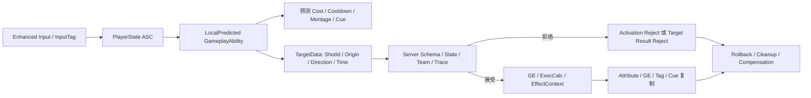

# Co-op GAS 面试复习资料

> 适用分支：`coop-GAS`
>
> 引擎：Unreal Engine 5.5
>
> 文档职责：只解释项目架构、网络预测边界、真实问题、工具操作和面试回答。
>
> 不负责：任务状态、排期、封板范围。所有任务只看 [TODO](GAS_Portfolio_Technical_Route.md)，项目入口只看 [README](../README.md)。

## 1. 30 秒项目说明

这是一个服务器权威的 UE5.5 双人 Co-op GAS Demo。玩家通过 Damage、Ally Heal、Immunity 三项 `LocalPredicted` Ability 完成合作机关和战斗。ASC/AttributeSet 位于 PlayerState，Character 是可更换 Avatar。客户端预测技能激活、资源、冷却和部分表现，但不能决定目标是否合法、是否命中、最终伤害/治疗、暴击、死亡或胜利。

项目重点不是技能数量，而是同一技能在弱网下同时满足：

```text
本地立即响应
+ 服务器重新验证
+ 接受时不双播
+ 拒绝时清理可逆状态
+ 最终属性、GE、Tag、Cue 一致
```

## 2. 同步模型与总体架构

本项目是**服务器权威状态同步 + CharacterMovement/GAS 有限客户端预测**，不是帧同步或 Lockstep。



| 状态 | 权威所有者 | 客户端职责 |
|---|---|---|
| Health/Energy/战斗属性 | 服务器 PlayerState ASC | 预测自身可逆变化，显示复制结果 |
| AbilitySpec/Cost/Cooldown | 服务器授予和确认 | Owning Client 可预测激活 |
| 命中/伤害/暴击 | 服务器 Trace + ExecCalc | 只提交最小意图和播放反馈 |
| 死亡/复活 | 服务器 PlayerState/GameMode | 禁止输入、表现死亡和新 Avatar 重绑 |
| 门/钥匙/平台/胜利 | 服务器 Actor/GameState | 显示 RepNotify/复制状态 |
| AI 决策 | 服务器 | 只接收 Movement、Attribute、Tag 和 Cue |

### 2.1 C++ 域边界与蓝图契约

- PlayerState 使用项目 ASC 子类，负责输入、PredictionKey、DamageIntent/ShotId 和实验诊断；Guardian 使用基础 `UAbilitySystemComponent`，不继承玩家输入/RPC/测试状态。
- 玩家 Ability 基类只保留预测、Montage 和表现事务共性；Damage、Ally Heal、Immunity 的实现分离到独立编译单元，保持原 UClass/资产路径不变，避免一个“大 Ability 文件”继续增长。
- Ally Heal 的 TargetTask 是纯 C++ 原生委托，不暴露无消费者的蓝图异步节点；蓝图只接收本地 `On Heal Target Previewed` 表现事件。
- 三项玩家 Ability 共享一个 `FmultiplayerAbilityMontageConfig`，Character 只实现一个 `On Ability Presentation Phase`；该事件不能被蓝图主动调用，也不能应用 GE。
- Guardian 只向关卡蓝图开放 `Register/Unregister Channeling Participant` 两个权威入口；护盾、AI 阶段、伤害和奖励仍由 C++/GAS 决定。
- EnemyBP 只实现一个 `On Guardian Presentation`，读取复制快照后驱动 AnimBP/VFX/UI；不再暴露每种状态各一套委托和事件。

## 3. GAS 默认机制与项目实现边界

面试时不能把 GAS 自带能力全部包装成项目自研。

| UE/GAS 提供 | 项目配置或实现 |
|---|---|
| ASC、AbilitySpec、GE、Attribute 复制 | ASC 放 PlayerState、Mixed 模式、Avatar 重绑策略 |
| `LocalPredicted` 激活 RPC | 三项 Ability 的 Cost/Cooldown/Tag/结束规则 |
| PredictionKey 与预测 GE 清理 | 真 Reject 实验、结构化日志、可视化状态和离线核验器 |
| TargetData RPC 缓存与 Delegate | DamageIntent Schema、ShotId、时间/方向/Origin 校验和服务器 Trace |
| GameplayCue 分发与预测回放抑制 | Cue Tag 设计、Context 消费、Presenter、计数与生命周期验收 |
| GE Stacking 基础能力 | Vulnerability 的 AggregateByTarget、三层、刷新、Overflow 和整组到期规则 |
| CharacterMovement 预测校正 | 项目没有自研 SavedMove 或移动预测 |
| Actor Replication/RPC/RepNotify | 机关幂等、共享目标、Session 防重入和重开链 |

> GAS 提供预测事务框架，项目负责定义哪些状态可预测、服务器验证什么、结果如何收敛，以及怎样证明没有双播或残留。

## 4. 客户端预测核心

### 4.1 PredictionKey 是什么

PredictionKey 是一次预测事务的关联标识。它让客户端预测副作用、服务器激活结果和客户端清理回调对应到同一次操作。

它不是帧号、ShotId、反作弊凭证或全局业务事务号；`CaughtUp` 单独也不能证明服务器已经接受业务结果。

ShotId 负责业务幂等，PredictionKey 负责 GAS 预测事务，两者不能互换。

### 4.2 可以预测什么

- `LocalPredicted` Ability 的本地激活。
- 通过正常预测路径应用到 Owning Client 的 Cost/Cooldown GE。
- 自身可逆属性变化和持续 GE/Tag。
- 预测 Cast Cue、短时等待表现和 Montage。
- 本地准星查询和候选目标。

### 4.3 不能由客户端决定什么

- 对其他 Actor 的最终 Damage/Heal。
- `ExecutionCalculation` 的最终数值。
- 随机暴击、护甲、抗性和最终 Clamp。
- 队伍、LOS、距离、目标存活与最终 HitResult。
- Debuff 是否真正叠层、目标死亡、奖励和胜利。
- AI 决策。

### 4.4 接受、激活拒绝和目标拒绝

| 路径 | 服务器状态 | 客户端结果 |
|---|---|---|
| Accept | Ability 激活并 Commit | 预测状态与权威状态衔接；Owner 不重复播放同一预测 Cue |
| Activation Reject | 激活入口拒绝 | `ClientActivateAbilityFailed`，PredictionKey Rejected，预测 Cost/CD/持续 GE 清理 |
| Target Result Reject | Ability 已接受，但 TargetData 无效 | 不产生最终伤害；通常仍会 CatchUp，不能称为激活 Reject |

当前 M6 实验使用无 TargetData 的 Immunity 隔离真正激活 Key：服务器在预测窗口建立前一次性拒绝，客户端先看到预测 Energy/CD/Immunity/Pending，收到 Failed RPC 后恢复。下一次使用新 Key 正常接受。

### 4.5 什么不能真正回滚

已播放的一次性音效、瞬时粒子和 `ExecuteGameplayCue` 不能“倒放”。正确策略是：

- 瞬时预测反馈保持短且不承载权威结果；
- Owner 接收服务器回放时依赖 PredictionKey 抑制重复；
- 重要等待状态使用可移除的持续 GE/Cue；
- Reject 时停止 Montage、清除持续表现，必要时播放补偿反馈；
- 不声称“所有动画和 Cue 自动回滚”。

## 5. DamageIntent 与服务器权威边界

客户端 TargetTask 同时维护两种数据：

- 本地 `SingleTargetHit`：只供本进程预测表现使用，不上传；
- 网络 DamageIntent：只包含 ShotId、量化 Origin、量化 Direction、估算 ServerTime。

服务器处理顺序：

```text
精确 Schema
-> ShotId 非零、顺序与重复检查
-> Source 存活/状态
-> 时间、Origin、Direction 有限值和窗口
-> 服务器当前世界 Sweep
-> Team/目标存活/ASC
-> Ability 提交前轻量不变量
-> Commit Cost/Cooldown
-> 服务器 HitResult 写入 Context
-> ExecCalc / GE
```

关键边界：

- 客户端不上传最终 Actor、HitResult、伤害和 Critical。
- TargetTask 是服务器场景查询的唯一完整所有者；Ability 不再重复另一套距离/LOS Trace。
- 合法新 ShotId 即使后来因方向或目标拒绝也会被消费，避免同 ID 改参数反复试探。
- 50ms 最小间隔只是 Demo 级请求门禁，不是商业级 token bucket 或连接层 DoS 防护。
- 当前使用服务器当前世界，不是历史延迟补偿。

## 6. ExecCalc、属性捕获与 EffectContext

Source Snapshot：AttackPower、CriticalChance、CriticalMultiplier。

Target Live：Health/MaxHealth、Armor、Resistance。

Snapshot 在 Spec 创建时冻结施法者参数；Live Capture 在执行时读取目标当前防御和状态。是否 Snapshot 必须由技能语义决定，不能机械统一。

```text
BaseDamage + AttackPower
-> ArmorMultiplier
-> ResistanceMultiplier
-> VulnerabilityMultiplier
-> Server Critical Roll
-> IncomingDamage
-> AttributeSet Clamp / Death
```

所有 NaN/Inf 和极端乘法需要收敛为有限、保守结果。客户端显示伤害数字不等于客户端拥有伤害权威。

`FmultiplayerGameplayEffectContext` 携带 Critical、HitType、量化 ImpactImpulse 以及父类 HitResult/Instigator 数据。实现必须包含：

- `GetScriptStruct()` 返回自身；
- `Duplicate()` 深拷贝 HitResult；
- `NetSerialize()` 先处理父类，再序列化自定义位和量化向量；
- 自定义 `AbilitySystemGlobals` 分配正确 Context 类型。

服务器 ExecCalc 写入 Context，权威 Impact Cue 消费它。预测 Cast Cue 不能提前伪造最终 Critical。

## 7. Buff/Debuff 与 GameplayCue 生命周期

Vulnerability 规则：`AggregateByTarget`、上限三层、合法叠层刷新、Overflow 拒绝、整组到期、抑制叠层 Cue 重触发。

| Cue 类型 | 示例 | 规则 |
|---|---|---|
| 预测瞬时 | Damage Cast、Heal Cast | Owner 立即播放；服务器回放不得双播；Reject 只能补偿 |
| 权威瞬时 | Impact、Heal Result、Death burst | 服务器确认后触发，不预判最终结果 |
| 持续状态 | Immunity、Vulnerability、Prediction Pending | OnActive/WhileActive/Removed 分别统计；移除、死亡、Travel 后不得残留 |

`OnActive` 与 `WhileActive` 是两个合法生命周期事件，不能把总 Handler 次数简单当成双播。GAS 只抑制预测 Owner 收到服务器 echo，不会替项目去重同一端主动调用两次。

## 8. ASC、死亡与复活

ASC 放在 PlayerState 的原因：PlayerState 生命周期长于 Pawn，OwnerActor 稳定，AvatarActor 可以更换，复活后能复用同一玩家状态并保持授予幂等。

初始化：服务器 `PossessedBy`、客户端 `OnRep_PlayerState`，两端调用 `InitAbilityActorInfo(PlayerState, Character)`；AbilitySet 只由服务器授予一次。

```text
Health <= 0
-> 服务器幂等设置 Dead
-> 阻止输入/激活
-> Cancel Ability/Task
-> 清理规定的瞬态 GE/Tag/Cue
-> 复制死亡状态
-> Respawn Timer
-> RestartPlayer / 新 Pawn
-> 重绑 Avatar
```

延迟回调必须携带事务或生命周期身份。编译通过不能证明旧 Avatar、Timer、Delegate 或 TargetData 不会在新生命到达。

## 9. Co-op 状态设计

- Player TeamId 是团队事实；Team Tag 是 GAS/UI 镜像，不作为第二票权威。
- 两名玩家属于同队，Damage 拒绝友军。
- GameState 复制共享钥匙进度与胜利；GameMode 只在服务器决定 Restart/Travel。
- PressurePlate、Gate、KeySocket 和 WinArea 只在服务器修改 Gameplay 状态。
- 门复制语义状态并在客户端本地插值；MovingPlatform 由服务器移动并复制 Transform。
- Session 使用 OnlineSubsystem 异步 Delegate，不把 Session 操作包装成 Gameplay RPC。

## 10. 三个真实问题复盘

### PRED-001：把目标拒绝误认为 Prediction Reject

**现象**：服务器拒绝非法 TargetData 后没有伤害，但客户端只出现 CatchUp，没有 Rejected。

**被排除假设**：`EndAbility(...Cancelled)` 会自动触发完整预测 Reject。

**工具**：`LogAbilitySystem`、PredictionKey 结构化日志、UE5.5 `AbilitySystemComponent_Abilities.cpp` 调用链。

**根因**：服务器已经接受 Ability；TargetData 失败只是业务结果拒绝。

**解决**：用无 TargetData 的 Immunity 在服务器激活入口制造真正 Reject；TargetResult 另用 ShotId/Result 日志验证。

**经验**：激活事务结果与技能业务结果是两层协议。

### NET-001：服务器出现两套目标几何规则

**现象**：TargetTask 的权威 Sweep 已接受目标，Damage Ability 又用另一套起点和 Trace 复验。

**被排除假设**：服务器多校验一次只会更安全。

**工具**：`rg` 调用链审查、结构化 RejectReason、双进程 M6Intent verifier。

**根因**：Transport/Validation 与 Ability 结算没有唯一策略所有者。

**解决**：TargetTask 独占 Schema、时间、方向和场景查询；Ability 只复验对象、队伍、存活、ASC 等不变量。

**经验**：客户端过滤与服务器复验必须并存，但服务器内部同一规则只能有一个完整所有者。

### ARCH-001：Character 被教学和测试代码污染

**现象**：Character 同时承担输入、ASC、Cue 表现、M5/M6 状态机和旧网络教学 RPC，文件超过 1500 行。

**被排除假设**：总代码量大意味着 GAS 核心需要删减。

**工具**：`rg` 引用审查、按职责统计行数、资产引用扫描、Editor/Game 构建和网络回归。

**根因**：运行时职责与开发实验夹具混在同一个 Actor。

**解决**：删除教学链；自动化迁入 DeveloperHarness，Cue 状态迁入 Presenter，保留核心预测和权威链。

**经验**：精简架构应移除错误职责，不能为了行数删除技术深度。

完整问题记录使用[问题定位模板](GAS_Problem_Investigation_Record_Template.md)，并保留至少一个被证据排除的假设。

## 11. 面试 Top 20 快速回答

| 问题 | 项目化回答关键词 |
|---|---|
| GAS 核心组件 | ASC 管理 Ability/GE/Tag；GA 表达行为；GE 修改属性/状态；AttributeSet 定义属性 |
| 按键到生效 | Enhanced Input → InputTag → ASC Spec → LocalPredicted GA → Server Validate → GE/ExecCalc |
| ASC 放哪 | PlayerState 是稳定 Owner，Character 是可更换 Avatar |
| 三种复制模式 | Player 用 Mixed；正式 AI 适合 Minimal；Full 适合小规模所有 GE 都相关的对象 |
| PredictionKey | GAS 预测事务关联，不是帧号、ShotId 或安全令牌 |
| 回滚什么 | 可逆预测 GE/Attribute/Tag/CD；瞬时音画不能真正倒放 |
| GE 三种策略 | Instant、Duration、Infinite；Periodic 不适合客户端预测最终结算 |
| Cost/Cooldown | CommitAbility 统一检查和应用预测 GE，服务器仍是最终权威 |
| GameplayTag | 层级化语义状态和查询，不用散落 bool 复制同一规则 |
| Buff 堆叠 | 聚合主体、上限、刷新、Overflow、到期和 Cue 策略必须同时定义 |
| ENetRole | Authority、AutonomousProxy、SimulatedProxy 描述本 Actor 网络角色 |
| RPC 类型 | Server 提交 Owner 意图；Client 返回特定连接结果；Multicast 不替代持久状态 |
| 属性同步 vs RPC | 属性/RepNotify 表达当前状态；RPC 表达一次事件或请求 |
| 客户端预测 | 先执行可逆本地事务，服务器确认或拒绝后收敛 |
| 移动校正 | CharacterMovement 自带预测/校正；本项目没有自研 SavedMove |
| 延迟补偿 | 当前是服务器当前世界 Trace；有限 SSR 不能当成已实现成果 |
| 实体插值 | Simulated Proxy 渲染平滑，不等于输入预测或历史回溯 |
| Listen vs Dedicated | Listen Host 有本地玩家；Dedicated 没有 Viewport/LocalPlayer/UI 假设 |
| Co-op 如何同步 | 属性/GE/Tag/GameState 状态复制，输入/意图 RPC，服务器权威机关和战斗 |
| 帧同步 vs 状态同步 | 本项目是状态同步；PredictionKey 不是同步帧号 |

## 12. 工具与具体操作

### 12.1 构建与自动化

```powershell
Engine\Build\BatchFiles\Build.bat multiplayerEditor Win64 Development <uproject>
Engine\Build\BatchFiles\Build.bat multiplayer Win64 Development <uproject>
```

```text
UnrealEditor-Cmd.exe <uproject>
-ExecCmds="Automation RunTests multiplayer.GAS;Quit"
-unattended -nop4 -nosplash -NullRHI
-DDC=InstalledNoZenLocalFallback
```

编译只证明 UHT/C++/链接；配置 Automation 证明静态资产与公式契约；它们都不能替代双进程行为和视觉验收。

### 12.2 双进程与弱网

```powershell
PowerShell -ExecutionPolicy Bypass -File .\Scripts\StartGASM5TwoPlayers.ps1
PowerShell -ExecutionPolicy Bypass -File .\Scripts\VerifyGASM6Logs.ps1 -RunId <RunId>
PowerShell -ExecutionPolicy Bypass -File .\Scripts\VerifyGASM6IntentLogs.ps1 -RunId <RunId>
```

必须在 Host/Client 日志确认 `PktLag set to ...`、`PktLoss set to ...`。两端各设置 150ms outgoing lag 时，近似 RTT 是 300ms，不能写成“150ms RTT”。

M5 verifier 是日志清点；M6/M6Intent verifier 才是失败返回非零的行为门禁。工具名不能替代它实际断言的内容。

### 12.3 定位工具

- Visual Studio：条件断点、调用堆栈、Role/PredictionKey/SpecHandle。
- `UE_LOG`：固定 Phase、Ability、Spec、PredictionKey、ShotId、Actor、Role、最终计数。
- `showdebug abilitysystem`：查看 Ability、GE、Tag、属性。
- Gameplay Debugger：服务器 AI、目标和状态 Tag；没有运行证据时标“待使用”。
- Collision Debug/Debug Draw：区分客户端候选 Trace 与服务器权威 Trace。
- Blueprint Debugger：Widget/AnimBP/GameplayCueNotify 的 Execution Trace 和 Watch Value。
- Network Insights：只有保存 `.utrace` 并完成同条件前后对比后才能声称做过优化。
- MemReport/Object List：多轮死亡/Travel 后检查 Task、Widget、Timer 和 UObject 增长。

## 13. 证据解释

主要历史证据：

- [M4 ExecCalc / Context / Stacking](Evidence/GAS_M4_Execution_Context_Stacking_Test_Report.md)
- [M5 GameplayCue / Prediction](Evidence/GAS_M5_GameplayCue_Prediction_Test_Report.md)
- [M6 Prediction Reject / Rollback](Evidence/GAS_M6_Prediction_Reject_Rollback_Test_Report.md)
- [M6 DamageIntent](Evidence/GAS_M6_Damage_Intent_Security_Test_Report.md)
- [M6 Run summaries](Evidence/Runs/M6/README.md)
- [M6Intent Run summaries](Evidence/Runs/M6Intent/README.md)
- [Phase 3–4 regression](Evidence/Runs/Phase34/README.md)

```text
源码存在 ≠ 编译通过
编译通过 ≠ 自动化通过
自动化通过 ≠ 双进程行为正确
Headless 日志通过 ≠ UMG/动画/VFX 肉眼正确
单次 5% loss ≠ 丢包稳定性统计
历史 RunId ≠ 当前 HEAD 精确回归
```

## 14. 可以与不可以声称

可以准确声称：

- 完成 PlayerState ASC、三项预测技能、ExecCalc、Context、堆叠和死亡复活核心；
- 完成真正激活 Reject 的可重复实验和 DamageIntent 服务器权威链；
- 使用 0ms、约 300ms RTT 和单次 5% loss 日志验证部分接受/拒绝路径；
- 能解释 GAS 默认预测机制与项目自研验证、日志和生命周期部分。
- Ally Heal 与 Guardian 的 C++ 权威链、统一表现接口已通过 Editor/Game 构建和 `multiplayer.GAS` 6/6 契约自动化；正式资产与双进程行为仍分开验收。

不能声称：

- 已完成正式 Ally Heal/Guardian 的蓝图资产、Montage/Niagara 或可见胜利 UI（当前仅 C++ 契约完成）；
- 已完成 Dedicated Server、晚加入、有限 SSR 或 Network Insights 优化；
- 所有 GameplayCue/动画都能自动回滚；
- 一次丢包样本代表完整弱网统计；
- DamageIntent 等于商业反作弊；
- 项目采用帧同步、全世界回滚或自研 CharacterMovement 预测。
