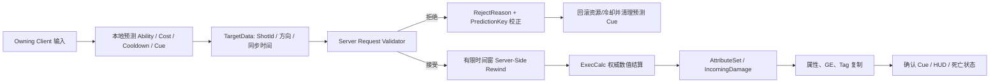

# Co-op GAS 作品集技术路线与执行清单

> 适用分支：`coop-GAS`
>
> 更新日期：2026-08-15
>
> 唯一目标：完成一个**合格、完整的 GAS 双人 Demo**，并用可复现实验达到**接近进阶的网络同步深度**。

本文是当前执行主线。架构原理、真实问题复盘和面试场景题见
[《Co-op GAS 架构与面试讲解手册》](GAS_Architecture_Interview_Guide.md)；更长的源码阅读和扩展研究见
[《UE5.5 GAS 与网络预测深度路线》](GAS_Network_Deep_Dive_Roadmap.md)。

面试复习入口见 [《Co-op GAS 与多人网络必问 Top 20》](GAS_Multiplayer_Interview_Top20_QA.md)。
后续每个里程碑的真实问题、风险和场景题必须按
[《GAS 问题定位记录模板》](GAS_Problem_Investigation_Record_Template.md)记录定位工具、具体操作、被排除假设和分层验证；不得为了显得有深度虚构排查经过。

---

## 1. 目标边界

### 1.1 GAS 合格线

最终版本必须具备：

- PlayerState 持有 ASC/AttributeSet，Character 作为 Avatar。
- 服务器和客户端 ActorInfo 初始化、重生重绑和能力授予幂等。
- 伤害、队友治疗、状态免疫三个完整能力。
- InputTag、AbilitySet、Cost、Cooldown、GameplayTag 和属性复制。
- `GameplayEffectExecutionCalculation` 和 Meta Attribute 结算。
- 自定义 `GameplayEffectContext` 与网络序列化。
- 一个有明确聚合、刷新和移除规则的可堆叠 Buff/Debuff。
- GameplayCue 的预测、确认、拒绝清理和去重。
- 死亡、复活、Ability/Task/GE 生命周期清理。
- 正式输入、HUD、技能表现、双客户端功能测试。

### 1.2 接近进阶的网络同步线

必须用运行证据完成三项专题：

1. **预测与回滚**：LocalPredicted 激活、Cost/Cooldown/Cue 预测、服务器接受和拒绝后的客户端校正。
2. **有限延迟补偿**：只为一个 Hitscan 能力实现有最大时间窗的服务器回溯，不回滚整个世界。
3. **作弊防护边界**：客户端只提交意图，服务器验证时间、位置、方向、目标、资源、状态、频率和重复请求，并决定最终伤害。

### 1.3 明确不做

- 不实现全世界确定性回滚、Lockstep 或自定义 CharacterMovement 预测。
- 不实现商业级反作弊、EAC、录像审计和后端风控。
- 不全量迁移 Aura/Lyra 的技能树、装备、存档、MVC 或 GameFeature。
- 不在没有 Network Insights 数据前引入 Replication Graph、Iris 定制或 100Hz PlayerState。
- 不为了展示 GAS 重写稳定的压力板、门、钥匙和移动平台。

---

## 2. 当前基线

### 2.1 已实现并有代码证据

- GAS 插件和模块依赖。
- PlayerState ASC/AttributeSet 与 Mixed 复制。
- `PossessedBy`、`OnRep_PlayerState` ActorInfo 初始化。
- 原生 GameplayTag 输入和 AbilitySet 单一授予源。
- LocalPredicted 伤害、治疗、免疫。
- Cost、Cooldown、TargetData AbilityTask 和 PredictionKey 上传。
- DamageIntent 只序列化 ShotId、量化 Origin/方向和估算 ServerTime；PlayerState ASC 跨 Pawn 维护 ShotId guard。
- 服务器验证 Schema/source、幂等/最小间隔、时间/Origin/方向，并在当前世界权威 Sweep 重建 HitResult。
- IncomingDamage/IncomingHealing Meta Attribute。
- Enhanced Input、AbilitySet/InitStats 资产接线与基础 GAS HUD。
- 团队规则、准星 Sphere Sweep、SingleTargetHit 与服务器二次校验。
- 死亡幂等、临时状态清理、3 秒复活和 ASC Avatar 重绑。
- 服务器 ExecCalc、自定义 EffectContext NetSerialize、三层 Vulnerability 堆叠。
- AttackPower、Armor、CriticalChance、CriticalMultiplier、Resistance 五项复制战斗属性；InitStats 共 9 项。
- ExecCalc 已区分 Source Snapshot 进攻属性和 Target Live 防御/生命属性，随机暴击由服务器 Roll，纯函数接受确定性 Roll 用于自动化。
- 7 个原生 GameplayCue、PredictionKey CatchUp 日志和持续 Cue 生命周期。
- 胜利 Presenter 已完成 Widget 幂等创建/清理、输入与鼠标恢复、重开按钮服务器意图链；Character Blueprint 已保存 `winandquit` 类引用。
- Editor/Game 编译与 `multiplayer.GAS.Configuration` 配置测试。

### 2.2 已取得的运行证据

- M0～M4 的 Listen Server + Client 核心链路已逐阶段验收。
- M5 0ms 接受路径：5 次合法 Damage 的 Owner/Host Cast Handler 各 5 次，权威 Impact/Critical、Heal、Immunity、Vulnerability 清理和死亡复活通过。
- M5 每方向 150ms（约 300ms RTT）接受路径：4 次合法 Damage 的预测领先服务器 115～121ms，CatchUp 后 Owner 无重复 Cast；持续 Cue 事件计数一致。
- 弱网自动序列另有 1 次输入在创建 PredictionKey 前被本地 Cooldown 门禁；它不是服务器 Reject，也不是丢包。
- M6 真实激活拒绝子阶段：0ms、每方向 150ms（约 300ms RTT）以及一组每方向 150ms + 5% 丢包样本均通过 95/95 日志断言；拒绝事务的预测 Energy Cost、Cooldown、Immunity GE/Cue 与 Pending 表现均已清理，下一次合法激活使用新 Key 并正常 CatchUp。
- M6 DamageIntent：`multiplayer.GAS.DamageIntent.Unit` 通过；0ms 运行 `20260813_163052` 与双方 `PktLag=150` 运行 `20260813_163248` 各 52/52 PASS。Shot 1/7 各只 Commit/伤害一次，Duplicate、Origin、Direction、Stale、Future、Miss 均被拒绝，预测 Energy/CD 最终收敛。TargetData 等待已有 5 秒超时，Task 在数据到达、超时/结束时清理委托和 Timer，Damage Ability 在 `CommitAbility` 前验证权威目标、目标 ASC 和 DamageSpec。
- 阶段 3～4 回归：Editor/Game Development 通过，`multiplayer.GAS` 2/2；M5 `20260815_002532` 清点正常、M6 `20260815_002809` 95/95；此前 M6Intent 0ms `20260815_002959` 与约 300ms RTT `20260815_003155` 均 52/52，追加 finite clamp/restart gate 后的最终二进制 0ms `20260815_004559` 再次 52/52。这些均为 Headless 技术证据，不替代胜利 UI 人工点击/视觉验收。

### 2.3 尚未取得的关键证据

- 没有 Host 反向输入、非 Headless 视觉/HUD完整录屏和持续 Cue 状态下死亡证据。
- 丢包目前只有一组 5% 样本，没有多轮统计、10% 丢包或约 600ms RTT 矩阵。
- 没有 Dedicated Server、晚加入和带行为断言的服务器+双客户端自动化结果。
- 没有 DamageIntent 的 loss、Dedicated Server、快速移动、友军和遮挡专项运行矩阵；`TargetDataTimeout`、`SourceDead`、`InvalidTarget`、`CommitFailed` 也仍缺专项双进程端到端分支。当前限频是 50ms 最小间隔，不是 token bucket。
- 没有服务器回溯延迟补偿实现。
- 没有 Network Insights 优化前后数据。

因此当前准确结论是“GAS M0～M5 核心闭环，以及 M6 真实激活拒绝回滚和 DamageIntent 当前世界服务器权威验证已完成”，不是“商业反作弊、服务器回溯或完整进阶网络同步已完成”。

---

## 3. 最终网络调用链



权威边界：客户端可以预测响应并提交候选数据，但不能决定命中、伤害、暴击、资源、Cooldown、死亡或胜利。

---

## 4. 阶段路线

以下工期按每周 15～20 小时估算。每阶段只有在“代码、资产、运行、证据”四层都满足时才能关闭。

### M0：冻结和验收当前基线（1～2 天）

任务：

- 建立独立 GAS 测试地图和固定双窗口参数。
- 确认两个玩家实际类型都是 `multiplayerGASPlayerState`。
- 验证 ASC 初始化、治疗、免疫、Energy、Cost 和 Cooldown 基础链。
- 确认玩家统一属于 `Team.Player` 且服务器禁止互伤。
- 增加最小 `Team.Enemy` 训练目标后，验证伤害、超距、墙体遮挡、目标死亡和能量不足。
- 保存 Host/Client 分离日志；失败项建立真实问题编号。

退出门禁：

- 有一份逐项填写的双窗口结果表。
- 伤害结果来自敌对训练目标/敌人，不能使用玩家互相攻击冒充合作玩法验收。
- 失败项有复现步骤，不能用“代码看起来正确”替代运行证据。

### M1：正式输入、AbilitySet 和基础 HUD（第 1～2 周）

代码任务：

- 使用 Enhanced Input 将 InputAction 映射到 InputTag。
- 自动化调试入口放入独立 Developer Harness，并由命令行显式启用；Character 不保留数字键旁路。
- 增加正式 AbilitySet、InitAttributes 和 Blueprint GE 配置入口。
- 建立 HUD 与 PlayerState ASC 的绑定/解绑生命周期。

资产任务：

- 三个 InputAction、一个 InputMappingContext。
- 默认 AbilitySet、初始化 GE、Cost/Cooldown GE。
- Health、Energy、Cooldown 和状态 HUD。

退出门禁：

- 正式输入能激活三个能力。
- UI 不因重复初始化或 Pawn 更换重复绑定。
- AbilitySet 缺失时明确报错且不标记已授予，配置自动化负责提前发现。

### M2：合作目标、队伍规则和最终瞄准（第 2～3 周）

代码任务：

- 增加权威 TeamId 或团队接口。
- 伤害拒绝友军；治疗/免疫只接受合法队友或自身。
- 将 M0 的“最近 `Team.Enemy` 训练目标”替换为准星 Trace、TargetActor 或正式 Hitscan 候选数据。
- 服务器验证类型、队伍、存活、距离、视线和施法状态。

退出门禁：

- 客户端不能伤害队友、治疗敌对目标或伪造最终伤害。
- 同一目标在 Host/Client 上得到一致权威结果。
- 目标选择方案可以复用于后续服务器回溯实验。

### M3：死亡、复活和 ASC 状态清理（第 3～4 周）

当前状态：**核心通过**。0ms 与约 300ms RTT 接受路径均回归通过；断线、Travel 和持持续 Cue 时死亡仍待测。

代码任务：

- 服务器幂等处理 Health 到 0 和 `State.Dead`。
- 死亡时阻止激活、取消指定 Ability/Task，删除不能跨死亡保留的 GE。
- 处理死亡期间晚到 TargetData、Montage、Timer 和 Delegate。
- 复活时更换 AvatarActor、恢复规定属性且不重复授予能力。
- 明确 Cooldown、免疫和 Debuff 是否跨死亡保留。

退出门禁：

- 死亡只结算一次；死亡期间无新技能结果。
- 复活后 ASC、AttributeSet 和能力数量正确。
- 无残留 Task、重复 Delegate、旧 Avatar 回调或跨生命伤害。

### M4：ExecCalc、EffectContext 和堆叠（第 4～6 周）

当前状态：**核心通过并完成战斗属性扩展**。服务器已计算 AttackPower、Armor、Resistance、Critical 与 Vulnerability；Context 自动化与双端 Cue 消费已通过，存活目标溢出/层数 UI/晚加入待测。

代码任务：

- 已实现 AttackPower、Armor、CriticalChance/CriticalMultiplier 和 Resistance，并为复制、Clamp 与 InitStats 建立自动化契约。
- 用 `GameplayEffectExecutionCalculation` 输出 IncomingDamage。
- 实现自定义 EffectContext 的 `GetScriptStruct`、`Duplicate`、`NetSerialize`。
- 携带暴击、格挡、命中类型或冲量等确有消费者的数据。
- 实现一个可堆叠 Debuff，明确 Source/Target 聚合、层数、刷新、溢出和移除。

测试任务：

- 已完成伤害公式边界、概率/低血量暴击、Armor/Resistance、Vulnerability、Clamp 和非有限输入的确定性自动化。
- EffectContext 跨网络复制测试。
- 堆叠、到期、移除、死亡清理和晚加入测试。

退出门禁：

- 客户端无法决定伤害或暴击。
- 相同服务器输入产生可解释结果。
- Context 字段和堆叠状态有真实消费者及双端证据。

### M5：GameplayCue 与正式技能表现（第 6～7 周）

当前状态：**接受路径技术闭环通过，完整表现门禁未关闭**。0ms/约 300ms RTT 的预测、确认、去重与生命周期有日志证据；M6 已补真实拒绝后的预测 GE/Tag/占位表现清理，正式资产和非 Headless 视觉仍待补。

任务：

- 建立伤害、暴击、治疗、免疫、Debuff 和死亡 Cue。
- 接入 Montage、Niagara、音效和必要 AnimNotify。
- 区分预测 Cue、服务器确认、服务器拒绝和持续 Cue 生命周期。
- Actor 死亡/销毁/Travel 时停止循环 Cue。

退出门禁：

- 0ms 下不双播。
- 高延迟下预测表现立即出现。
- 服务器拒绝后没有残留预测 GE、Cooldown、Immunity Tag、Pending Cue 或占位灯（M6 日志门禁已通过）；正式音效、Niagara 与 HUD 录屏仍待验证。

### M6：预测拒绝、回滚和作弊防护（第 7～9 周）

当前状态：**真实激活拒绝/回滚与 DamageIntent 当前世界服务器权威验证核心均通过；补充矩阵未关闭**。详见
[《GAS M6：预测拒绝与回滚实验报告》](Evidence/GAS_M6_Prediction_Reject_Rollback_Test_Report.md)和
[《GAS M6：DamageIntent 安全验证报告》](Evidence/GAS_M6_Damage_Intent_Security_Test_Report.md)。

任务：

- 增加结构化 `EAbilityRejectReason`。
- 日志关联 SpecHandle、PredictionKey、ShotId、目标、时间和 GE Handle。
- 加入请求去重、频率限制、施法状态、Cost/Cooldown 和队伍验证。
- 实验服务器接受、超距、遮挡、目标死亡、资源不足和施法者死亡。
- 使用 0/150/300ms、5% 丢包和低帧率组合测试。

退出门禁：

- 服务器拒绝不产生最终伤害。
- 预测 Cost/Cooldown/Cue 能校正或清理。
- 重复请求不会重复结算。
- 每种拒绝都能用双端日志解释，且没有 Task/Delegate/Timer 残留。

### M7：有限延迟补偿 / Server-Side Rewind（第 9～10 周）

只为一个 Hitscan 伤害能力实现，不抽象成全项目通用回滚框架。

代码任务：

- 服务器按固定频率保存角色/目标约 250～500ms 的碰撞历史环形缓冲。
- 复用 M6 已实现的 DamageIntent，不再新增客户端命中数据。
- 在已有时间/Origin/方向/频率验证之后，增加 250～500ms 历史快照选择与最大回溯窗口。
- 使用历史查询碰撞体做 Trace；不要移动真实玩法 Actor 造成可见抖动或并发污染。
- 复用 M6 已验证的 ShotId 幂等边界，单独证明回溯查询不会绕过它。

验收矩阵：

| 场景 | 预期 |
|---|---|
| 0ms 静止/移动目标 | 当前 Trace 与回溯结果一致 |
| 150ms 移动目标 | 能命中客户端开火时看到的合法位置 |
| 超过最大回溯窗口 | 服务器拒绝 |
| 未来时间、异常起点/方向 | 服务器拒绝 |
| 重复 ShotId | 只结算一次 |
| 目标在开火后死亡/销毁 | 按明确规则拒绝，不访问失效对象 |

退出门禁：

- 有“无回溯/有回溯”同条件录像和命中率数据。
- 能解释回溯只补偿网络延迟，不保证客户端一定命中。
- 不把一个有限 Hitscan 实验宣传为全类型技能延迟补偿。

### M8：双客户端自动化、Dedicated Server 和晚加入（第 10～12 周）

任务：

- 保留配置单元测试，另建功能级服务器+双客户端自动化。
- 断言属性复制、目标拒绝、免疫、Cooldown、死亡复活和胜利幂等。
- 增加 Server Target，完成 Dedicated Server 无渲染运行。
- 验证晚加入的属性、持续 GE/Tag、Buff 层数、钥匙、门、平台和胜利状态。
- 测试 Travel、断线和重新开始后的 ASC/UI 生命周期。

退出门禁：

- Dedicated Server 与两个客户端可以完成一局。
- 自动化能稳定暴露至少一个故意注入的错误。
- 晚加入得到当前持久状态，且瞬时 Cue 不错误重播。

### M9：Network Insights、优化、打包和证据包（第 12～14 周）

任务：

- 固定地图、玩家/AI 数量、技能频率、网络参数和机器配置。
- 记录 RPC/s、复制字节、属性/GE/Cue 流量、Actor 更新和 P95/P99 帧时间。
- 一次只修改一个变量，选择一项真实瓶颈优化。
- 使用完全相同条件复测，保留对应提交号。
- 完成 Development/Shipping 打包、两实例整局验收。
- 输出 README、架构图、时序图、问题复盘、测试报告和 3～5 分钟视频。

退出门禁：

- 至少一项优化有前后数据，不使用主观 FPS 感受作证。
- 打包版本完成房间、机关、技能、死亡复活和胜利流程。
- 简历只陈述已经有代码和证据支持的结果。

---

## 5. 作弊防护验证矩阵

| 客户端提交 | 服务器必须验证 | 客户端不能决定 |
|---|---|---|
| InputTag/激活意图 | 能力是否授予、状态、Cost、Cooldown | 是否能够施法 |
| 候选目标 | 类型、队伍、存活、距离、视线 | 目标是否合法 |
| Trace 起点/方向 | 与权威位置/视角的偏差、归一化、射程 | 是否命中 |
| 同步时间 | 非未来、非过旧、最大回溯窗口 | 回溯到任意时间 |
| ShotId/PredictionKey | 所有权、有效激活、重复与频率 | 是否重复结算 |
| 技能配置标识 | 服务器数据资产和等级 | 伤害、暴击、资源和持续时间 |

“作弊防护完成”的作品集口径仅指：服务器权威、输入约束、重复/频率控制和异常请求拒绝。它不等于商业反作弊产品。

---

## 6. 证据要求

每个里程碑至少提交：

| 证据层级 | 最低要求 |
|---|---|
| C++ | Editor/Game 编译；关键类和调用链链接 |
| 蓝图/资产 | 资产名称、父类、关键配置截图；蓝图编译通过 |
| 手工运行 | Host/Client 预期与实际结果；网络参数 |
| 自动化 | 测试名、命令、结果和失败时日志 |
| 弱网 | 延迟/丢包/低帧率组合和 PredictionKey/ShotId 日志 |
| 性能 | 相同场景的基线/修改/复测；平均、P95/P99 和字节/RPC |
| 遗留问题 | 待验证、已知限制和下一步；禁止把计划写成完成 |

问题复盘还必须附上使用的工具与操作，并按
[问题定位记录模板](GAS_Problem_Investigation_Record_Template.md)区分“真实问题”、“风险分析”和“场景题”。

---

## 7. 当前下一批任务

当前执行范围只补充 GAS 内容，不返工已经稳定的门、压力板、钥匙、移动平台和胜利流程。严格按以下顺序执行：

1. **先做阶段 3 人工封板**：在两个可见窗口完成四钥匙、双人 WinArea、两端胜利 UI、Client 重开和退出；保存 `COOP_VICTORY_UI` 日志与录屏。当前资产引用和 C++ 生命周期已通过编译/自动化，但视觉与真实点击仍待人工。
2. **补齐合作型技能语义**：保留 Damage 只攻击 `Team.Enemy`、Immunity 自用；把当前 Self Heal 扩展为服务器验证的队友治疗，或增加独立 Ally Heal，明确不能治疗敌人、死亡目标或超距/遮挡目标。
3. **整理 C++/资产边界**：把 Damage、Vulnerability、Healing、Immunity Effect Class 以及 Montage/Cue 表现引用暴露为 `EditDefaultsOnly`；AbilitySet 保持唯一授予源，核心 Commit、ExecCalc、Context、PredictionKey、TargetData 和服务器验证不得复制到蓝图。
4. **完成正式内容层**：创建技能数据资产、正式 GameplayCue、GAS HUD 和 Montage；每个 Tag 只保留一个表现所有者，Widget 只读 ASC/PlayerState。
5. **补资产与人工证据**：逐个蓝图 Compile/Save，运行 Host/Client 非 Headless 矩阵并录像，验证队友治疗、Cue 次数、Cooldown UI、死亡/复活清理和持持续 Cue 时死亡。
6. **网络专题继续收口**：补 loss、快速移动、友军、遮挡、Host 反向输入与更高延迟，再进入 Dedicated、晚加入和 Network Insights；不在没有数据时提前引入 Replication Graph 或 Iris。

下一批结束时应交付：

```text
三个正式 GAS 技能资产（Damage / Ally Heal / Immunity）
+ 正式 GameplayCue、HUD、Montage 和技能图标
+ RejectReason / PredictionKey / ShotId 调试面板与关联日志
+ 0/150/300ms、丢包与非 Headless 双端矩阵
+ Cost/Cooldown/持续 Cue 回滚及死亡清理证据
+ 请求去重、频率、方向、时间和团队校验证据
+ GAS 内容与 M6 网络问题复盘
```

---

## 8. 时间和里程碑

| 里程碑 | 计划周期 | 当前状态/结果 |
|---|---:|---|
| M0～M1 | 1～2 周 | 核心完成；正式输入/HUD 的配置自动化通过，完整人工 UI 矩阵待补 |
| M2～M3 | 2 周 | 核心完成；团队目标、死亡复活的 0ms/弱网接受路径通过，边界待补 |
| M4～M5 | 3 周 | 核心完成；ExecCalc/Context/堆叠及 Cue 接受路径通过，正式表现待补 |
| M6～M7 | 3 周 | M6 Reject 回滚与 DamageIntent 当前世界权威验证核心通过；M6 补充矩阵与 M7 有限延迟补偿待完成 |
| M8 | 2 周 | 待开始：自动化、Dedicated Server 和晚加入 |
| M9 | 2 周 | 待开始：Insights、打包和作品集证据 |

总计约 10～14 周业余开发。若 M0 暴露较多现有运行问题，先修复基线，不能通过压缩测试时间维持日期。

---

## 9. 最终完成口径

项目只有同时满足以下条件才达到本路线目标：

- 三个能力具有正式输入、数值、UI、Cue、死亡/复活和合作用途。
- 预测接受/拒绝、Cost/Cooldown/Cue 校正都有弱网证据。
- 一个 Hitscan 能力完成有限服务器回溯，并有异常时间/位置/重复请求拒绝测试。
- Dedicated Server、两个客户端、晚加入和打包整局通过。
- 至少一项网络优化有 Network Insights 同条件前后数据。
- 技术文档能区分代码、资产、运行、性能和未完成项。

达到这些条件后，可以准确表述为“合格 GAS + 接近进阶网络同步”；在此之前只描述已经通过的具体阶段。
